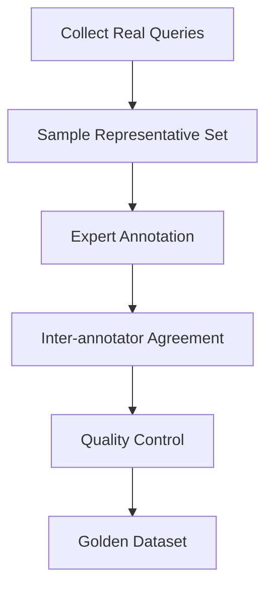

# Evaluation Frameworks for Search Systems

This document outlines systematic approaches to testing and validating search performance across different indexing strategies.

## 🏗️ Framework Overview

### 1. Golden Dataset Approach
Create a curated set of queries with known relevant documents as ground truth for offline testing.

#### Dataset Creation Process


#### Components of a Golden Dataset
1. **Query Collection**
   - Real user queries from logs
   - Synthetic queries covering edge cases
   - Query variations (typos, synonyms, different phrasings)

2. **Relevance Judgments**
   - Binary relevance (relevant/not relevant)
   - Graded relevance (0-3 scale)
   - Aspect-based relevance (topical, temporal, geographic)

3. **Query Categories**
   ```python
   query_categories = {
       "navigational": {
           "description": "Looking for specific page/entity",
           "examples": ["Microsoft homepage", "iPhone 15 specs"],
           "key_metric": "MRR"
       },
       "informational": {
           "description": "Seeking knowledge/understanding", 
           "examples": ["how to bake bread", "machine learning algorithms"],
           "key_metric": "nDCG@10"
       },
       "transactional": {
           "description": "Intent to perform action",
           "examples": ["buy laptop online", "book hotel room"],
           "key_metric": "Conversion Rate"
       }
   }
   ```

#### Quality Assurance
- **Inter-annotator Agreement**: Cohen's Kappa > 0.7
- **Annotation Guidelines**: Clear, consistent criteria
- **Edge Case Coverage**: Misspellings, jargon, ambiguous queries
- **Temporal Relevance**: Regular updates for time-sensitive content

### 2. Judgment Lists Framework
Systematic collection and management of relevance judgments.

#### Explicit Judgments (Human-labeled)
```python
judgment_structure = {
    "query_id": "q_001",
    "query_text": "best wireless headphones 2024",
    "document_id": "doc_12345",
    "relevance_score": 2,  # 0-3 scale
    "judgment_type": "explicit",
    "annotator_id": "expert_001",
    "timestamp": "2024-11-04T10:30:00Z",
    "confidence": 0.9,
    "notes": "Good match but missing price comparison"
}
```

#### Implicit Judgments (Behavior-based)
```python
implicit_signals = {
    "click_data": {
        "position": 3,
        "dwell_time": 45.2,
        "bounce_rate": 0.23,
        "scroll_depth": 0.8
    },
    "session_data": {
        "query_reformulations": 2,
        "session_success": True,
        "time_to_success": 120
    }
}
```

#### Judgment Collection Strategies
1. **Crowdsourcing**
   - Platforms: Amazon MTurk, Prolific, internal teams
   - Quality control: Qualification tests, consensus requirements
   - Cost: $0.10-$1.00 per judgment

2. **Expert Annotation**
   - Domain experts for specialized content
   - Higher cost but better quality
   - Use for complex or sensitive queries

3. **Active Learning**
   - Prioritize uncertain predictions for annotation
   - Reduces annotation cost by 30-50%
   - Iterative improvement of training data

### 3. A/B Testing Framework
Compare indexing strategies using live user traffic and behavioral metrics.

#### Experimental Design
```python
ab_test_config = {
    "test_name": "vector_vs_keyword_search",
    "hypothesis": "Vector search improves relevance for product queries",
    "success_metrics": ["CTR", "conversion_rate", "user_satisfaction"],
    "guardrail_metrics": ["latency", "error_rate"],
    "traffic_split": {
        "control": 0.5,  # BM25 keyword search
        "treatment": 0.5  # Hybrid vector + keyword
    },
    "duration": "2_weeks",
    "minimum_sample_size": 10000,
    "significance_level": 0.05
}
```

#### Implementation Steps
1. **Pre-experiment Analysis**
   - Historical baseline metrics
   - Sample size calculation
   - Randomization strategy

2. **Experiment Execution**
   ```python
   class SearchExperiment:
       def assign_user_to_group(self, user_id):
           hash_value = hash(f"{user_id}_{self.experiment_id}")
           return "treatment" if hash_value % 2 == 0 else "control"
       
       def log_interaction(self, user_id, query, results, clicked_positions):
           group = self.get_user_group(user_id)
           self.metrics_logger.log({
               "experiment_id": self.experiment_id,
               "user_group": group,
               "query": query,
               "results_shown": len(results),
               "clicks": clicked_positions,
               "timestamp": datetime.now()
           })
   ```

3. **Statistical Analysis**
   - Two-proportion z-test for CTR
   - Student's t-test for continuous metrics
   - Bootstrap confidence intervals
   - Multiple comparison corrections

#### Key Considerations
- **Network Effects**: User interactions may affect others
- **Novelty Effects**: Initial performance boost from new features
- **Seasonal Variations**: Account for time-based patterns
- **Segment Analysis**: Different user groups may respond differently

## 📊 Evaluation Pipeline Architecture

### Offline Evaluation Pipeline
```python
class OfflineEvaluator:
    def __init__(self, golden_dataset, metrics_config):
        self.dataset = golden_dataset
        self.metrics = self.initialize_metrics(metrics_config)
    
    def evaluate_indexing_strategy(self, strategy_name, search_engine):
        results = {}
        
        for query_set in self.dataset.get_query_sets():
            predictions = search_engine.search(query_set.queries)
            
            # Calculate metrics
            for metric in self.metrics:
                score = metric.calculate(predictions, query_set.ground_truth)
                results[f"{metric.name}_{query_set.category}"] = score
        
        return self.generate_report(strategy_name, results)
```

### Online Evaluation Pipeline
```python
class OnlineEvaluator:
    def __init__(self, experiment_config):
        self.config = experiment_config
        self.metrics_tracker = MetricsTracker()
    
    def track_search_interaction(self, user_id, query, results, interactions):
        user_group = self.get_experiment_group(user_id)
        
        # Real-time metrics
        self.metrics_tracker.update_ctr(user_group, interactions.clicks > 0)
        self.metrics_tracker.update_mrr(user_group, interactions.first_click_position)
        
        # Delayed metrics (tracked later)
        self.schedule_conversion_tracking(user_id, interactions.session_id)
```

## 🔄 Continuous Evaluation Framework

### Monitoring and Alerting
```python
monitoring_config = {
    "metrics_thresholds": {
        "ctr_drop": 0.05,          # Alert if CTR drops >5%
        "latency_increase": 100,    # Alert if P95 latency >100ms higher
        "error_rate": 0.01         # Alert if error rate >1%
    },
    "evaluation_frequency": {
        "real_time": ["error_rate", "latency"],
        "hourly": ["ctr", "conversion_rate"],
        "daily": ["ndcg", "map", "user_satisfaction"],
        "weekly": ["full_evaluation_suite"]
    }
}
```

### Feedback Loop Integration
1. **Model Retraining**
   - Use new relevance signals to update ranking models
   - Incorporate user feedback for continuous improvement
   - A/B test model updates before full deployment

2. **Index Optimization**
   - Monitor query patterns for index tuning
   - Adjust vector dimensions based on performance
   - Update keyword analysis for new terminology

3. **Quality Assurance**
   ```python
   class QualityMonitor:
       def detect_quality_degradation(self, current_metrics, baseline_metrics):
           alerts = []
           for metric, current_value in current_metrics.items():
               baseline_value = baseline_metrics.get(metric)
               if baseline_value and self.is_significant_drop(current_value, baseline_value):
                   alerts.append(f"Quality drop detected in {metric}")
           return alerts
   ```

## 🎯 Framework Selection Guide

### Choose Golden Dataset When:
- **Establishing baselines** for new search systems
- **Comparing multiple** indexing strategies offline
- **Limited user traffic** for A/B testing
- **Regulatory requirements** for deterministic evaluation

### Choose A/B Testing When:
- **Sufficient user traffic** (>1000 sessions/day)
- **Real-world performance** validation needed
- **Business impact** measurement required
- **User experience** optimization is priority

### Choose Judgment Lists When:
- **Domain-specific** search requirements
- **Expert knowledge** needed for relevance
- **Continuous learning** from user behavior
- **Hybrid approach** combining explicit and implicit signals

## 📈 Success Criteria Definition

### Tier 1 Metrics (Must Improve)
- Primary business metric (CTR, conversion rate)
- Core relevance metric (nDCG@10 or MAP)
- User satisfaction score

### Tier 2 Metrics (Should Not Degrade)
- System performance (latency, throughput)
- Coverage metrics (recall, success@10)
- Secondary business metrics

### Tier 3 Metrics (Nice to Have)
- Advanced relevance metrics (ERR, RBP)
- Segment-specific improvements
- Long-term engagement metrics

---
*Next: [Indexing Strategies](./03-indexing-strategies.md)*