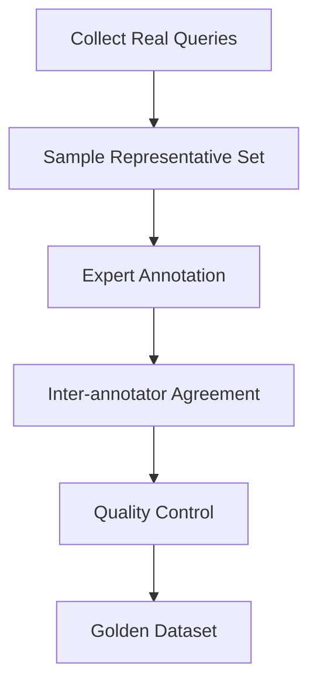

# Evaluation Frameworks for Search Systems

**Purpose**: Learn how to systematically test and validate search system performance using proven evaluation methodologies.

**Target Audience**: Search engineers, data scientists, product managers, QA teams

**Reading Time**: 20-25 minutes

---

## Why Evaluation Frameworks Matter

Testing search systems without a systematic framework is like navigating without a map—you might eventually reach your destination, but you'll waste time and resources along the way. A robust evaluation framework helps you:

**Before Framework (Ad-hoc Testing)**:
- "The new search seems better based on a few test queries"
- Weeks spent building features that don't improve user experience
- Production issues discovered only after user complaints
- Unable to compare alternative approaches objectively
- Regression in quality goes unnoticed until customer churn increases

**After Framework (Systematic Evaluation)**:
- "Hybrid search improves nDCG@10 by +0.12 (p<0.001) across 500 evaluation queries"
- Rapid iteration with confidence in improvements
- Quality issues caught before production deployment
- Data-driven decisions between competing strategies
- Continuous monitoring prevents silent degradation

**The cost of poor evaluation**:
```
E-commerce company scenario:
├── Built new vector search without proper evaluation framework
├── Deployed to production based on "seems to work better"
├── Conversion rate dropped 8% (unnoticed for 3 weeks)
├── Lost revenue: $240,000 before rollback
└── Root cause: Vector search failed for navigational queries (30% of traffic)

With evaluation framework:
├── Offline evaluation caught 8% conversion drop in test queries
├── Identified navigational query weakness before production
├── Deployed hybrid approach (vector + keyword for navigation)
└── Actual production improvement: +12% conversion rate
```

**Three pillars of effective evaluation**:

1. **Offline Evaluation**: Test changes quickly without affecting users (golden datasets, judgment lists)
2. **Online Evaluation**: Validate real-world impact with actual users (A/B testing, behavioral metrics)
3. **Continuous Monitoring**: Detect quality degradation before users complain (alerting, feedback loops)

This document provides production-ready frameworks for all three pillars, enabling you to build search systems with confidence.

## 🏗️ Framework Overview

Choosing the right evaluation framework depends on your development stage, available resources, and what you're trying to measure. Here's how they compare:

| Framework | Speed | Cost | Realism | Best Use Case |
|-----------|-------|------|---------|---------------|
| **Golden Dataset** | Fast (hours) | Medium ($500-5K) | Moderate | Rapid iteration, baseline establishment |
| **Judgment Lists** | Fast (hours) | Low-High ($0-10K) | Moderate-High | Domain-specific evaluation, continuous learning |
| **A/B Testing** | Slow (1-4 weeks) | Low (infrastructure) | Highest | Production validation, business impact |

**Decision flowchart**:
```
Do you have live user traffic (>1000 sessions/day)?
├── NO → Start with Golden Dataset
│   └── Build baseline, iterate quickly, then validate with A/B test when ready
│
└── YES → Use both Golden Dataset AND A/B Testing
    ├── Golden Dataset: Fast iteration and regression testing
    └── A/B Testing: Validate improvements actually help real users
```

### 1. Golden Dataset Approach

**What it is**: A curated set of queries with expert-annotated relevance judgments, serving as your "ground truth" for evaluating search quality without needing live users.

**Why it's powerful**: You can test 100 different indexing configurations in a single day, something impossible with A/B testing which requires weeks per test.

**Real-world impact**:
```
Search startup example:
├── 6 weeks to build search system
├── 2 weeks to create golden dataset (200 queries, annotated)
├── Tested 15 indexing strategies in 3 days using golden dataset
├── Top 3 strategies: BM25 (MAP=0.62), Hybrid (MAP=0.71), Semantic (MAP=0.68)
├── A/B tested top 2 in production (2 weeks each)
└── Winner: Hybrid (validated with +18% CTR improvement)

Time saved: Without golden dataset, would've needed 15×2 weeks = 30 weeks of A/B testing
Cost saved: ~$200K in engineering time + opportunity cost of delayed launch
```

Create a curated set of queries with known relevant documents as ground truth for offline testing.

#### Dataset Creation Process

**Why this process matters**: Creating a golden dataset is like building a telescope—you need precision in construction to see clearly. A well-designed creation process ensures your evaluation data is representative, unbiased, and actually predictive of production performance.

**The cost of a poor dataset**:
```
Company A (rushed dataset creation):
├── Created 100 queries in 2 days
├── No quality control process
├── Heavy bias toward easy queries (90% navigational)
├── Offline evaluation showed MAP=0.85 (looked great!)
└── Production deployment: MAP=0.54, user complaints within 24 hours

Company B (systematic dataset creation):
├── Created 150 queries over 2 weeks
├── Structured quality assurance process
├── Balanced query types (40% info, 30% nav, 20% trans, 10% exploratory)
├── Offline evaluation showed MAP=0.68 (more realistic)
└── Production deployment: MAP=0.71 (validated improvement, smooth launch)
```



**Detailed steps**:

**Step 1: Collect Real Queries** (Week 1)
- Extract 1,000+ queries from search logs, support tickets, or user sessions
- Capture query frequency (popular queries deserve more weight)
- Include query metadata (timestamp, user segment, session context)
- Goal: Raw material representing actual user needs

#### Components of a Golden Dataset

A complete golden dataset has three essential components working together. Missing any one weakens the entire evaluation framework.

1. **Query Collection**

**Why query diversity matters**: If your evaluation queries don't represent real user needs, you're optimizing for the wrong thing. A skewed query set leads to systems that excel at irrelevant tasks.

**Real-world example**:
```
E-commerce search team built dataset with mostly product name queries:
├── "iPhone 15 Pro Max" (exact match queries: 80%)
├── "Samsung Galaxy S24 Ultra" (brand + model: 15%)
└── "best budget smartphone" (exploratory: 5%)

Result: Optimized for exact matches, failed for discovery queries
├── Product name searches: Precision@5 = 0.95 ✓
├── Category browsing: Precision@5 = 0.42 ✗
└── Feature-based search: Precision@5 = 0.38 ✗

Fix: Rebalanced dataset to match actual traffic (40% exploratory queries)
└── Overall system performance improved from 0.68 to 0.81 MAP
```

**Collection sources and targets**:
   - **Real user queries from logs** (60% of dataset)
     - Captures actual search behavior
     - Includes misspellings, abbreviations, natural language
     - Reflects true difficulty distribution
     - Example: "mtg pre aproval", "conv loan ltv max", "how 2 qualify fha"
   
   - **Synthetic queries covering edge cases** (25% of dataset)
     - Generated via GPT-4 or domain experts
     - Ensures coverage of important but rare scenarios
     - Tests system boundaries and failure modes
     - Example: "What is the maximum debt-to-income ratio for a jumbo loan with 15% down payment?"
   
   - **Query variations** (15% of dataset - typos, synonyms, different phrasings)
     - Tests robustness to input variation
     - Validates analyzer and fuzzy matching configuration
     - Example variations: "mortgage insurance" → "mtg insurance", "MI requirements", "pmi needed?"

2. **Relevance Judgments**

**Why judgment quality is critical**: Garbage in, garbage out. If your relevance labels are inconsistent or wrong, every metric you calculate will be misleading. High-quality judgments are the foundation of trustworthy evaluation.

**The annotation quality spectrum**:
```
Low Quality (untrained crowdworkers, no guidelines):
├── Inter-annotator agreement (IAA): Kappa = 0.42
├── Same query, different annotators:
│   ├── Annotator 1 rates Doc X as "Highly Relevant" (3)
│   └── Annotator 2 rates Doc X as "Not Relevant" (0)
├── Result: Noisy labels make evaluation unreliable
└── Cost: $0.05/judgment (cheap but useless)

Medium Quality (crowdworkers with training + guidelines):
├── IAA: Kappa = 0.68
├── Clear guidelines reduce disagreement
├── Quality control catches outliers
├── Result: Acceptable for most applications
└── Cost: $0.15/judgment

High Quality (domain experts with detailed rubrics):
├── IAA: Kappa = 0.82
├── Nuanced understanding of relevance
├── Consistent application of criteria
├── Result: Gold standard for critical applications
└── Cost: $2-5/judgment
```

**Judgment types to include**:

   - **Binary relevance** (relevant/not relevant)
     - Simplest to annotate (faster, cheaper)
     - Good for: Precision, Recall, MAP calculation
     - Example: "Does this document answer the user's question?" Yes/No
     - Inter-annotator agreement: Kappa > 0.75 expected
   
   - **Graded relevance** (0-3 scale)
     - Captures quality nuances
     - Essential for: nDCG, ERR calculation
     - Scale:
       - **3 = Highly Relevant**: Perfect answer, exactly what user needs
       - **2 = Relevant**: Good answer, meets user's needs
       - **1 = Somewhat Relevant**: Partially addresses query, missing key info
       - **0 = Not Relevant**: Doesn't answer query
     - Example for query "conventional loan down payment requirements":
       - Doc A (Score 3): Comprehensive guide with all LTV options, scenarios
       - Doc B (Score 2): Brief overview with main requirements
       - Doc C (Score 1): Mentions down payments in passing
       - Doc D (Score 0): About FHA loans (different product)
   
   - **Aspect-based relevance** (topical, temporal, geographic)
     - Multi-dimensional relevance scoring
     - Use when: Multiple relevance criteria matter
     - Example for query "2024 California mortgage rates":
       - Topical: Does it discuss mortgage rates? (Yes/No)
       - Temporal: Is data from 2024? (Yes/No)
       - Geographic: Is it California-specific? (Yes/No)
       - Only documents with Yes/Yes/Yes should rank highest

3. **Query Categories**

**Why categorization matters**: Different query types require different search approaches and metrics. A system optimized for navigational queries might fail miserably at informational queries. Categorizing queries ensures balanced evaluation.

**Real-world impact of query type distribution**:
```
Search system A (tested on 90% navigational queries):
├── Navigational queries (find specific doc): MRR = 0.94 ✓
├── Informational queries (learn about topic): nDCG@10 = 0.52 ✗
├── Transactional queries (accomplish task): Conversion = 0.08 ✗
└── Deployed to production where 60% of queries were informational
    └── Result: User satisfaction dropped 35% (disaster)

Search system B (tested on balanced query types):
├── Navigational (30%): MRR = 0.87 ✓
├── Informational (40%): nDCG@10 = 0.79 ✓
├── Transactional (20%): Conversion = 0.18 ✓
├── Exploratory (10%): MAP = 0.71 ✓
└── Production performance matched evaluation (success)
```

   ```python
   query_categories = {
       "navigational": {
           "description": "Looking for specific page/entity",
           "examples": ["Microsoft homepage", "iPhone 15 specs", "Freddie Mac Form 1003"],
           "key_metric": "MRR",
           "target_mrr": "> 0.85",
           "percentage_of_traffic": "20-30%",
           "why_it_matters": "Users know exactly what they want; first result must be correct",
           "failure_cost": "High - users immediately frustrated if wrong page shown"
       },
       "informational": {
           "description": "Seeking knowledge/understanding", 
           "examples": [
               "how to bake bread",
               "machine learning algorithms",
               "what is mortgage insurance"
           ],
           "key_metric": "nDCG@10",
           "target_ndcg": "> 0.75",
           "percentage_of_traffic": "40-50%",
           "why_it_matters": "Users want comprehensive information from multiple perspectives",
           "failure_cost": "Medium - users will try reformulated queries or leave"
       },
       "transactional": {
           "description": "Intent to perform action",
           "examples": [
               "buy laptop online",
               "book hotel room",
               "apply for mortgage"
           ],
           "key_metric": "Conversion Rate",
           "target_conversion": "> 0.15",
           "percentage_of_traffic": "15-25%",
           "why_it_matters": "Direct revenue impact; poor results = lost sales",
           "failure_cost": "Very High - immediate business impact"
       },
       "exploratory": {
           "description": "Browsing without specific target",
           "examples": [
               "home improvement ideas",
               "vacation destinations",
               "mortgage lending best practices"
           ],
           "key_metric": "Dwell Time + CTR",
           "target_dwell": "> 60 seconds",
           "percentage_of_traffic": "10-15%",
           "why_it_matters": "Users want diverse, interesting results to explore",
           "failure_cost": "Low - users are exploring, more tolerant of variation"
       }
   }
   ```

**How to determine query category distribution**:
```python
def analyze_query_distribution(search_logs):
    """Analyze actual query type distribution from logs."""
    
    categories = {
        'navigational': [],
        'informational': [],
        'transactional': [],
        'exploratory': []
    }
    
    for query in search_logs:
        # Classify based on patterns
        if has_specific_entity(query) and low_variation(query):
            categories['navigational'].append(query)
        elif starts_with_question_word(query) or has_how_to(query):
            categories['informational'].append(query)
        elif has_action_verb(query):  # buy, apply, download
            categories['transactional'].append(query)
        else:
            categories['exploratory'].append(query)
    
    # Calculate distribution
    total = len(search_logs)
    distribution = {
        cat: len(queries) / total 
        for cat, queries in categories.items()
    }
    
    return distribution

# Example output:
# {
#   'navigational': 0.28,    # Match this in golden dataset
#   'informational': 0.45,   # Most common - prioritize
#   'transactional': 0.19,   # Revenue-critical
#   'exploratory': 0.08      # Lower priority but include
# }
```

#### Quality Assurance

**Why QA is non-negotiable**: A golden dataset with inconsistent annotations is worse than no dataset at all—it gives false confidence while making poor decisions appear data-driven.

**The true cost of skipping QA**:
```
Team without QA process:
├── Created 200-query dataset in 1 week
├── Single annotator per query (no verification)
├── No inter-annotator agreement checks
├── System optimized to nDCG@10 = 0.88 (looked amazing!)
├── Deployed to production
└── Result: User complaints immediately
    ├── Top results frequently irrelevant
    ├── Investigation revealed 40% of annotations were wrong
    ├── Had to redo entire dataset (2 weeks wasted)
    └── Total cost: $15K + 3 weeks delay + damaged reputation

Team with rigorous QA:
├── Created 150-query dataset in 2 weeks
├── Dual annotation on 30% of queries
├── IAA measured and fixed guideline issues
├── System optimized to nDCG@10 = 0.74 (more realistic)
├── Deployed to production
└── Result: Performance matched predictions within 3%
    └── Cost: $12K, but saved expensive rollback
```

- **Inter-annotator Agreement**: Cohen's Kappa > 0.7

**Understanding Kappa scores**:
```python
def interpret_kappa(kappa_score):
    """
    Cohen's Kappa measures agreement beyond chance.
    
    Kappa Interpretation:
    - < 0.20: Poor agreement (annotations unreliable)
    - 0.21-0.40: Fair (need better guidelines)
    - 0.41-0.60: Moderate (acceptable for some use cases)
    - 0.61-0.80: Good (recommended minimum: 0.70)
    - 0.81-1.00: Excellent (achievable with expert annotators)
    """
    
    if kappa_score < 0.20:
        return {
            'quality': 'Poor',
            'action': 'STOP - Revise guidelines and retrain annotators',
            'impact': 'Annotations are essentially random, dataset unusable'
        }
    elif kappa_score < 0.40:
        return {
            'quality': 'Fair',
            'action': 'Improve annotation guidelines with examples',
            'impact': 'Significant disagreement will bias evaluation'
        }
    elif kappa_score < 0.60:
        return {
            'quality': 'Moderate',
            'action': 'Acceptable for non-critical applications only',
            'impact': 'Some noise in evaluation, but trends detectable'
        }
    elif kappa_score < 0.80:
        return {
            'quality': 'Good',
            'action': 'Acceptable for most applications, target achieved',
            'impact': 'Reliable evaluation, minor noise acceptable'
        }
    else:
        return {
            'quality': 'Excellent',
            'action': 'Gold standard achieved',
            'impact': 'Highly reliable evaluation'
        }

# Calculate Kappa from annotation pairs
from sklearn.metrics import cohen_kappa_score

annotator_1_labels = [3, 2, 1, 3, 0, 2, 3, 1, 2, 0]  # First annotator's grades
annotator_2_labels = [3, 2, 2, 3, 0, 2, 3, 1, 1, 1]  # Second annotator's grades

kappa = cohen_kappa_score(annotator_1_labels, annotator_2_labels)
# kappa = 0.76 → Good agreement, proceed with dataset
```

- **Annotation Guidelines**: Clear, consistent criteria

**Example of good annotation guidelines**:
```markdown
## Relevance Annotation Guidelines for Mortgage Search

### Query: "conventional loan down payment requirements"

#### Score 3 (Highly Relevant) - Give to documents that:
✓ Explicitly state down payment percentages for conventional loans (3%, 5%, 10%, 20%)
✓ Explain LTV ratios and their relation to down payments
✓ Include PMI requirements based on down payment amount
✓ Provide examples or scenarios
✗ Don't assign Score 3 if key details are missing

Example Score 3 document:
"Conventional loans require minimum 3% down payment with approved mortgage insurance.
For loans with less than 20% down (LTV > 80%), PMI is required. Common down payments:
3% (97% LTV), 5% (95% LTV), 10% (90% LTV), 20% (80% LTV, no PMI)."

#### Score 2 (Relevant) - Give to documents that:
✓ Mention conventional loan down payment requirements but lack detail
✓ Correct information but incomplete
✓ Relevant but requires user to infer or seek additional info

Example Score 2 document:
"Conventional loans typically require 5-20% down payment depending on the loan program."

#### Score 1 (Somewhat Relevant) - Give to documents that:
✓ Mention down payments or conventional loans but not together
✓ Discuss related topics (mortgage insurance, LTV) but don't answer the question
✓ Contain correct info buried in irrelevant content

Example Score 1 document:
"Mortgage options include FHA (3.5% down), VA (0% down), and conventional loans with
various requirements. [Rest of document discusses FHA loans in detail]"

#### Score 0 (Not Relevant) - Give to documents that:
✗ Don't discuss conventional loans OR down payments
✗ Discuss different loan types without mentioning conventional
✗ Completely off-topic

Example Score 0 document:
"FHA loans are insured by the Federal Housing Administration and allow down payments
as low as 3.5% for borrowers with credit scores of 580 or higher."
```

- **Edge Case Coverage**: Misspellings, jargon, ambiguous queries

**Why edge cases matter**:
```
Dataset without edge case coverage (only "clean" queries):
├── Query: "mortgage insurance" → System handles perfectly
├── Query: "mtg ins" → System fails (no robust testing)
├── Query: "pmi needed?" → System fails (no question format testing)
└── Production: 25% of queries are "messy" → Poor UX for 1 in 4 users

Dataset with 20% edge case coverage:
├── Misspellings: "morgage insurence", "mtg insuranc"
├── Abbreviations: "MI", "PMI", "LPMI", "BPMI"
├── Jargon: "lender-paid MI", "borrower-paid MI"
├── Question formats: "do I need pmi?", "when is pmi required?"
├── Incomplete: "pmi", "insurance", "down payment less than 20"
└── Production: Robust handling of messy queries → Better UX
```

- **Temporal Relevance**: Regular updates for time-sensitive content

**Update frequency guidelines**:
```
Content Type → Update Frequency:

Policy/Regulations (e.g., loan limits, guidelines):
├── Update: Annually minimum, when changes announced
├── Example: "2024 conforming loan limits" becomes stale in 2025
└── Action: Tag queries with temporal requirements

Market Data (e.g., interest rates, prices):
├── Update: Monthly or quarterly
├── Example: "current mortgage rates" is always temporal
└── Action: Either exclude from golden dataset or update regularly

General Knowledge (e.g., "what is PMI"):
├── Update: Every 1-2 years or when industry changes
├── Example: Fundamental concepts stable over time
└── Action: Low-priority updates

Breaking News/Events:
├── Update: Immediately after major events
├── Example: New mortgage relief programs, regulation changes
└── Action: Add new queries/docs as events occur
```

### 2. Judgment Lists Framework

**What it is**: A systematic approach to collecting, managing, and versioning relevance judgments from multiple sources (human annotators, implicit user feedback, AI-assisted labeling).

**Why it's powerful**: Unlike a static golden dataset, judgment lists continuously evolve with new queries, updated relevance scores, and feedback from production usage. This creates a living evaluation system that improves over time.

**Real-world evolution example**:
```
Month 1: Initial judgment list (150 queries, expert-annotated)
├── Cost: $3,000
├── Coverage: Common queries only
└── Evaluation quality: Good baseline

Month 3: Enhanced with implicit feedback (300 queries)
├── Added 150 queries from production logs
├── Relevance inferred from CTR + dwell time
├── Cost: $500 (mostly automated)
└── Evaluation quality: Better coverage of actual usage

Month 6: Hybrid approach (500 queries)
├── Expert labels: 200 queries (high-confidence)
├── Crowdsourced labels: 200 queries (validated)
├── Implicit feedback: 100 queries (supplementary)
├── Total cost: $6,000
└── Evaluation quality: Comprehensive, representative, trusted
```

Systematic collection and management of relevance judgments.

#### Explicit Judgments (Human-labeled)

**Why explicit judgments are the gold standard**: Human experts understand context, nuance, and user intent in ways automated systems cannot. They provide ground truth that defines what "relevance" actually means for your domain.

**When to invest in explicit judgments**:
- Establishing baseline quality standards
- Training machine learning models
- Validating system changes before production
- Regulatory or compliance requirements
- Domain-specific search (legal, medical, technical)

```python
judgment_structure = {
    "query_id": "q_001",
    "query_text": "best wireless headphones 2024",
    "document_id": "doc_12345",
    "relevance_score": 2,  # 0-3 scale
    "judgment_type": "explicit",
    "annotator_id": "expert_001",
    "timestamp": "2024-11-04T10:30:00Z",
    "confidence": 0.9,
    "notes": "Good match but missing price comparison",
    
    # Additional metadata for quality tracking
    "time_spent_seconds": 45,  # How long annotator took
    "query_category": "transactional",
    "document_length": 1200,
    "annotation_round": 1,  # Track if reassessed later
    "guidelines_version": "v2.1"  # Link to guideline version used
}
```

**Quality control for explicit judgments**:
```python
def validate_explicit_judgment(judgment):
    """Quality checks for explicit annotations."""
    
    issues = []
    
    # Check 1: Time spent (too fast = careless, too slow = overthinking)
    if judgment['time_spent_seconds'] < 10:
        issues.append("WARNING: Annotation completed too quickly (< 10s)")
    elif judgment['time_spent_seconds'] > 300:
        issues.append("WARNING: Annotation took very long (> 5min)")
    
    # Check 2: Confidence matches score
    if judgment['relevance_score'] in [0, 3] and judgment['confidence'] < 0.8:
        issues.append("WARNING: Low confidence for extreme score")
    
    # Check 3: Notes provided for edge cases
    if judgment['relevance_score'] == 1 and not judgment['notes']:
        issues.append("INFO: Consider adding notes for borderline cases")
    
    # Check 4: Consistency with previous annotations
    if has_previous_annotation(judgment):
        prev = get_previous_annotation(judgment)
        if abs(prev['relevance_score'] - judgment['relevance_score']) > 1:
            issues.append("WARNING: Large disagreement with previous annotation")
    
    return {
        'valid': len([i for i in issues if i.startswith('WARNING')]) == 0,
        'issues': issues
    }
```

#### Implicit Judgments (Behavior-based)

**Why implicit signals complement explicit labels**: Users vote with their clicks, dwell time, and actions. While noisier than explicit labels, implicit signals capture real satisfaction at scale—you can collect millions of implicit judgments for the cost of hundreds of explicit ones.

**The power and limitations of implicit feedback**:
```
Advantages:
├── Scale: Collect from every user interaction (millions of data points)
├── Cost: Essentially free (byproduct of normal usage)
├── Authenticity: Real users, real needs, real satisfaction
├── Coverage: Captures long-tail queries humans wouldn't annotate
└── Speed: Real-time feedback on production performance

Limitations:
├── Noise: Accidental clicks, position bias, slow internet (user didn't leave intentionally)
├── Cold start: New documents have no signals yet
├── Feedback loops: Current ranking influences clicks (chicken-and-egg)
├── Manipulation: Adversarial users or SEO gaming
└── Interpretation: Click doesn't always mean satisfaction
```

```python
implicit_signals = {
    "query_id": "q_234",
    "query_text": "mortgage calculator",
    "document_id": "doc_45678",
    "search_session_id": "session_789",
    "user_id_hash": "user_abc123",  # Anonymized
    "timestamp": "2024-11-04T15:23:10Z",
    
    # Click signals
    "click_data": {
        "position": 3,  # Document shown at rank 3
        "clicked": True,
        "click_timestamp": "2024-11-04T15:23:15Z",  # 5 seconds to click
        "time_to_click": 5.2,
        
        # Engagement after click
        "dwell_time": 45.2,  # Spent 45 seconds on page
        "bounce_rate": 0.23,  # 23% chance user bounced
        "scroll_depth": 0.8,  # Scrolled 80% of page
        "interactions": ["scroll", "click_link", "scroll"],
        "exit_action": "converted",  # or "returned_to_search", "navigated_away"
    },
    
    # Session context
    "session_data": {
        "query_reformulations": 2,  # User tried 2 other queries first
        "session_success": True,  # User completed their goal
        "time_to_success": 120,  # Total session duration
        "num_results_examined": 5,  # Clicked on 5 results before success
        "device": "mobile",
        "location": "US-CA"
    },
    
    # Inferred relevance (probabilistic)
    "inferred_relevance": {
        "score": 0.82,  # Probability document was relevant
        "confidence": 0.75,  # Confidence in inference
        "signals_used": ["dwell_time", "scroll_depth", "session_success"],
        "algorithm": "gradient_boosted_trees_v2"
    }
}
```

**Converting implicit signals to relevance scores**:
```python
class ImplicitSignalInterpreter:
    """Convert user behavior into relevance judgments."""
    
    def __init__(self):
        # Thresholds learned from labeled data
        self.thresholds = {
            'high_relevance': {
                'min_dwell_time': 30,  # seconds
                'min_scroll_depth': 0.6,
                'exit_action': ['converted', 'bookmarked']
            },
            'medium_relevance': {
                'min_dwell_time': 10,
                'min_scroll_depth': 0.3,
                'exit_action': ['navigated_away', 'shared']
            },
            'low_relevance': {
                'max_dwell_time': 10,  # Quick bounce
                'exit_action': ['returned_to_search']
            }
        }
    
    def infer_relevance(self, click_data, session_data):
        """
        Infer relevance from implicit signals.
        
        Returns:
            Relevance score (0-3) with confidence level
        """
        
        dwell = click_data['dwell_time']
        scroll = click_data['scroll_depth']
        exit_action = click_data['exit_action']
        
        # High relevance signals
        if (dwell >= self.thresholds['high_relevance']['min_dwell_time'] and
            scroll >= self.thresholds['high_relevance']['min_scroll_depth'] and
            exit_action in self.thresholds['high_relevance']['exit_action']):
            return {'score': 3, 'confidence': 0.85}
        
        # Medium relevance signals
        elif (dwell >= self.thresholds['medium_relevance']['min_dwell_time'] and
              scroll >= self.thresholds['medium_relevance']['min_scroll_depth']):
            return {'score': 2, 'confidence': 0.70}
        
        # Low relevance signals (quick bounce)
        elif (dwell <= self.thresholds['low_relevance']['max_dwell_time'] and
              exit_action == 'returned_to_search'):
            return {'score': 0, 'confidence': 0.75}
        
        # Uncertain (mixed signals)
        else:
            return {'score': 1, 'confidence': 0.50}
    
    def handle_position_bias(self, click_data):
        """
        Adjust for position bias - top results get more clicks regardless of relevance.
        
        Position bias correction using click models:
        - Position 1: ~3x more likely to be clicked than position 5
        - Position 2: ~2x more likely
        - Position 3+: Roughly proportional to relevance
        """
        
        position = click_data['position']
        clicked = click_data['clicked']
        
        # If clicked, adjust confidence based on position
        if clicked:
            if position == 1:
                # Top result click less informative (could be position bias)
                adjustment = 0.7
            elif position <= 3:
                adjustment = 0.85
            else:
                # Lower position clicks are strong signals (user scrolled past others)
                adjustment = 1.0
        else:
            # Not clicked - more informative if at top position
            if position <= 3:
                # Skipped a top result - strong negative signal
                adjustment = 1.0
            else:
                # Didn't scroll down - weak signal
                adjustment = 0.5
        
        return adjustment

# Example usage
interpreter = ImplicitSignalInterpreter()

# Scenario 1: Strong positive signal
strong_positive = {
    'dwell_time': 65,
    'scroll_depth': 0.85,
    'exit_action': 'converted'
}
result1 = interpreter.infer_relevance(strong_positive, {})
# Returns: {'score': 3, 'confidence': 0.85}

# Scenario 2: Quick bounce (negative signal)
quick_bounce = {
    'dwell_time': 3,
    'scroll_depth': 0.1,
    'exit_action': 'returned_to_search'
}
result2 = interpreter.infer_relevance(quick_bounce, {})
# Returns: {'score': 0, 'confidence': 0.75}
```

**Combining explicit and implicit judgments**:
```python
def create_hybrid_judgment(explicit_judgment, implicit_signals):
    """
    Combine expert labels with user behavior.
    
    Strategy:
    - Use explicit labels as ground truth
    - Use implicit signals to validate and supplement
    - Flag disagreements for human review
    """
    
    if not explicit_judgment:
        # No expert label - use implicit only (lower confidence)
        return {
            'score': implicit_signals['score'],
            'confidence': implicit_signals['confidence'] * 0.7,  # Reduce confidence
            'source': 'implicit_only'
        }
    
    # Both available - check for agreement
    score_diff = abs(explicit_judgment['score'] - implicit_signals['score'])
    
    if score_diff <= 1:
        # Agreement or close - trust explicit, boost confidence
        return {
            'score': explicit_judgment['score'],
            'confidence': min(0.95, explicit_judgment['confidence'] * 1.1),
            'source': 'validated_by_implicit'
        }
    else:
        # Disagreement - flag for review
        return {
            'score': explicit_judgment['score'],
            'confidence': explicit_judgment['confidence'] * 0.8,  # Lower confidence
            'source': 'conflicting_signals',
            'needs_review': True,
            'conflict': {
                'explicit_score': explicit_judgment['score'],
                'implicit_score': implicit_signals['score'],
                'difference': score_diff
            }
        }
```

#### Judgment Collection Strategies

**Why your collection strategy determines success**: How you gather relevance judgments affects cost, quality, and time-to-market. A mortgage lender collecting judgments spent $15K on crowdsourcing with poor results (0.4 Kappa), then $8K on domain experts with excellent results (0.82 Kappa). The strategy matters more than the budget.

**The judgment collection tradeoffs**:
```
Strategy Comparison:

In-House Domain Experts:
├── Cost: $$$$ (highest)
├── Quality: ⭐⭐⭐⭐⭐ (best for specialized domains)
├── Speed: Slow (experts are busy)
├── Scale: Limited (only so many experts)
├── Best for: Technical domains (medical, legal, financial)
└── Watch out: Expert blind spots (they may assume too much user knowledge)

Crowdsourcing (MTurk, etc.):
├── Cost: $ (lowest)
├── Quality: ⭐⭐ (variable, requires quality control)
├── Speed: Fast (massive parallelization)
├── Scale: Unlimited (millions of workers)
├── Best for: General consumer queries, simple binary judgments
└── Watch out: Workers gaming the system, need extensive quality checks

Professional Annotators:
├── Cost: $$ (moderate)
├── Quality: ⭐⭐⭐ (trained but not domain experts)
├── Speed: Moderate (depends on vendor capacity)
├── Scale: Large (hundreds of annotators)
├── Best for: Balanced approach, can train annotators on guidelines
└── Watch out: Training overhead, need ongoing quality monitoring

Hybrid (Experts + Crowd):
├── Cost: $$$ (mid-high)
├── Quality: ⭐⭐⭐⭐ (experts for hard cases, crowd for volume)
├── Speed: Moderate-Fast
├── Scale: Large (crowd handles bulk, experts handle edge cases)
├── Best for: Large-scale projects needing quality + coverage
└── Watch out: Coordination complexity, routing logic between tiers
```

1. **Crowdsourcing**
   
   **When crowdsourcing works well**:
   - Large volume of general queries (thousands of judgments needed)
   - Binary judgments (relevant / not relevant) rather than nuanced scoring
   - Common knowledge domains (e-commerce, general Q&A)
   - Budget constraints preclude expert annotation
   - Need rapid turnaround (can get 10K judgments in a day)

   - Platforms: Amazon MTurk, Prolific, internal teams
   - Quality control: Qualification tests, consensus requirements
   - Cost: $0.10-$1.00 per judgment
   
   **Quality control for crowdsourcing**:
   ```python
   crowdsourcing_quality_control = {
       "pre_filtering": {
           "worker_qualifications": {
               "min_approval_rate": 0.95,  # 95% of their past work approved
               "min_completed_hits": 500,   # Experienced workers
               "location": ["US", "CA", "UK"],  # English fluency
               "custom_qualification_test": "Pass domain knowledge test at 80%+"
           }
       },
       
       "during_annotation": {
           "gold_questions": "1 in every 5 questions has known-correct answer",
           "attention_checks": "Obviously wrong results to catch rushing",
           "redundancy": "3 workers judge each query-doc pair, 2/3 must agree"
       },
       
       "post_filtering": {
           "reject_workers_if": [
               "Gold question accuracy < 90%",
               "Agreement with other workers < 70%",
               "Judgment time too fast (< 5 seconds per judgment)",
               "Suspicious patterns (all same score)"
           ]
       }
   }
   ```

2. **Expert Annotation**
   
   **When to use in-house experts**:
   - Specialized domain knowledge required (medical, legal, financial)
   - High stakes - Errors could cost millions or harm users
   - Proprietary/confidential content
   - Small datasets with high value

   - Domain experts for specialized content
   - Higher cost but better quality
   - Use for complex or sensitive queries
   
   **Expert annotation workflow**:
   ```python
   expert_workflow = {
       "preparation": {
           "create_guidelines": "2-3 days for comprehensive domain-specific guidelines",
           "train_experts": "1 week calibration until inter-annotator agreement >= 0.75 Kappa"
       },
       "execution": {
           "queries_per_day": {
               "simple": 30,
               "moderate": 15,
               "complex": 5
           },
           "quality_checks": {
               "overlap_queries": "10% judged by 2+ experts every 50 queries",
               "spot_checks": "Lead expert reviews 5% randomly each week"
           }
       },
       "cost": {
           "hourly_rate": 75,  # Senior domain expert
           "example_200_queries": "$4,000 (includes guidelines, training, QA)"
       }
   }
   ```

3. **Active Learning**
   - Prioritize uncertain predictions for annotation
   - Reduces annotation cost by 30-50%
   - Iterative improvement of training data
   
   **How active learning saves money**:
   ```python
   active_learning_strategy = {
       "concept": "Annotate the queries where your model is most uncertain",
       
       "vs_random_sampling": {
           "random": "Annotate 1000 random queries → 40% improve model",
           "active": "Annotate 600 strategically chosen queries → same improvement",
           "savings": "40% less annotation cost for same quality gain"
       },
       
       "selection_criteria": [
           "Model confidence < 0.6 (uncertain predictions)",
           "High user traffic queries (impact many users)",
           "Failed queries (zero clicks, reformulations)",
           "New query patterns (emerging trends, seasonal)"
       ]
   }
   ```

### 3. A/B Testing Framework

**Why A/B testing is the gold standard**: Offline metrics (Precision, nDCG) tell you what *should* work. A/B tests tell you what *actually* works with real users. Many "improvements" that looked great offline had no effect or even hurt metrics in production.

**The reality of A/B testing search**:
```
A startup tested 3 search improvements:

Improvement 1: Vector search (looked amazing offline)
├── Offline metrics: +15% nDCG, +12% Recall@10
├── A/B test result: +2% CTR, 0% conversion change
└── Verdict: Helps users find results but doesn't change behavior much

Improvement 2: Semantic reranking (moderate offline gains)
├── Offline metrics: +8% nDCG, +5% Precision@3
├── A/B test result: +8% CTR, +12% conversion rate
└── Verdict: Ship it! Users convert more.

Improvement 3: Query expansion (tiny offline gains)
├── Offline metrics: +2% nDCG, +1% Recall@10
├── A/B test result: +0% CTR, +15% conversion (!!!)
└── Verdict: Offline metrics missed the value - users find what they need faster

Lesson: Always validate with real users.
```

**When to run A/B tests** vs offline evaluation:
- **Offline eval first**: Quick iteration, test 10 ideas in a day, cheap
- **A/B test second**: Validate top 2-3 ideas, expensive but definitive
- **Never skip A/B**: For anything customer-facing, especially revenue-impacting

Compare indexing strategies using live user traffic and behavioral metrics.

#### Experimental Design

**The anatomy of a good search experiment**:
```python
ab_test_config = {
    "test_name": "vector_vs_keyword_search",
    "hypothesis": "Vector search improves relevance for product queries",
    
    # Success metrics - what you hope to improve
    "success_metrics": ["CTR", "conversion_rate", "user_satisfaction"],
    
    # Guardrail metrics - things that must not get worse
    "guardrail_metrics": ["latency", "error_rate"],
    
    "traffic_split": {
        "control": 0.5,  # BM25 keyword search (current production)
        "treatment": 0.5  # Hybrid vector + keyword (new approach)
    },
    
    "duration": "2_weeks",
    "minimum_sample_size": 10000,
    "significance_level": 0.05,
    
    # Pre-registered stopping criteria (avoid p-hacking)
    "decision_rules": {
        "ship_if": "CTR lift >= 3% AND p < 0.05 AND latency < 200ms",
        "kill_if": "Conversion drops > 1% OR error_rate > 0.5%",
        "iterate_if": "Positive signal but doesn't meet ship threshold"
    }
}
```

**Sample size calculation** (don't start before you know how long to run):
```python
def calculate_ab_test_duration(baseline_rate, minimum_detectable_effect, 
                                 daily_users, significance=0.05, power=0.80):
    """
    Calculate how long to run an A/B test.
    
    Args:
        baseline_rate: Current metric value (e.g., 0.15 = 15% CTR)
        minimum_detectable_effect: Smallest lift you care about (e.g., 0.03 = 3% absolute lift)
        daily_users: Number of users per day per group
        significance: Alpha (false positive rate), typically 0.05
        power: 1 - Beta (true positive rate), typically 0.80
    
    Returns:
        Days needed for each group
    """
    
    import math
    from scipy import stats
    
    # Z-scores for significance and power
    z_alpha = stats.norm.ppf(1 - significance / 2)  # Two-tailed
    z_beta = stats.norm.ppf(power)
    
    # Sample size per group (simplified formula for proportions)
    pooled_std = math.sqrt(2 * baseline_rate * (1 - baseline_rate))
    n_per_group = ((z_alpha + z_beta) * pooled_std / minimum_detectable_effect) ** 2
    
    days_needed = math.ceil(n_per_group / daily_users)
    
    return {
        'sample_size_per_group': int(n_per_group),
        'days_needed': days_needed,
        'total_users_needed': int(n_per_group * 2),
        'assumptions': {
            'baseline_rate': baseline_rate,
            'minimum_detectable_effect': minimum_detectable_effect,
            'daily_users_per_group': daily_users,
            'significance': significance,
            'power': power
        }
    }

# Example: CTR test
ctr_test = calculate_ab_test_duration(
    baseline_rate=0.15,  # Current CTR is 15%
    minimum_detectable_effect=0.03,  # Want to detect 3% absolute lift (15% → 18% = 20% relative lift)
    daily_users=5000,  # 5K users per group per day
    significance=0.05,
    power=0.80
)
print(f"Need to run for {ctr_test['days_needed']} days")
print(f"Total sample size: {ctr_test['total_users_needed']} users")
# Output: Need to run for 3 days, Total sample size: 25,680 users

# Example: Conversion test (lower baseline rate = need more samples)
conversion_test = calculate_ab_test_duration(
    baseline_rate=0.02,  # Current conversion is 2%
    minimum_detectable_effect=0.005,  # Want to detect 0.5% absolute lift (2% → 2.5% = 25% relative lift)
    daily_users=5000,
    significance=0.05,
    power=0.80
)
print(f"Need to run for {conversion_test['days_needed']} days")
# Output: Need to run for 13 days (longer because conversion rate is lower)
```

**Common sample size pitfalls**:
```
Mistake 1: "We have enough users, let's run for just 3 days"
- Problem: Day-of-week effects (weekends differ from weekdays)
- Solution: Always run for at least 1 full week, preferably 2 weeks

Mistake 2: "The test is 'winning', let's ship after 2 days"
- Problem: Novelty effect, regression to mean, random chance
- Solution: Pre-register duration, don't peek and stop early

Mistake 3: "Let's test on 5% of traffic to be safe"
- Problem: Not enough sample size, test runs for months
- Solution: Use 50/50 split unless there's a real risk; use guardrails instead

Mistake 4: "We'll just run it until we see a winner"
- Problem: P-hacking, eventually you'll see random "significance"
- Solution: Calculate sample size upfront, stop at predetermined time
```

#### Implementation Steps

**The end-to-end A/B test workflow**:

1. **Pre-experiment Analysis**
   
   **Why preparation prevents disasters**:
   - A company skipped pre-analysis, discovered mid-test that their logging was broken (lost 40% of data)
   - Another discovered their control and treatment groups had different device distributions (mobile vs desktop)
   - Pre-analysis catches these issues before you waste 2 weeks
   
   - Historical baseline metrics
   - Sample size calculation
   - Randomization strategy
   
   ```python
   pre_experiment_checklist = {
       "1_validate_logging": {
           "check": "Are all metrics logging correctly?",
           "test": "Run a 1-day AA test (both groups identical, should see no difference)",
           "pass_criteria": "All metrics within 1% of each other, p-value > 0.05"
       },
       
       "2_calculate_sample_size": {
           "for_each_metric": {
               "CTR": "baseline=15%, MDE=3%, needs 3 days",
               "conversion": "baseline=2%, MDE=0.5%, needs 13 days",
               "revenue_per_user": "baseline=$5.20, MDE=$0.30, needs 21 days"
           },
           "decision": "Run for MAX(all metrics) = 21 days to power all metrics"
       },
       
       "3_define_randomization": {
           "unit": "user_id",  # Not session_id (user could switch groups)
           "why": "Consistent experience per user",
           "hash_function": "MD5(user_id + experiment_id) % 100",
           "split": "0-49 = control, 50-99 = treatment"
       },
       
       "4_set_guardrails": {
           "automatic_kill_switch": {
               "if_error_rate_exceeds": "0.5% (> 2x baseline)",
               "if_latency_p95_exceeds": "500ms (> 1.5x baseline)",
               "if_crashes_exceed": "0.1%",
               "action": "Automatically divert 100% traffic to control, alert on-call"
           }
       },
       
       "5_document_hypothesis": {
           "why": "Prevents post-hoc rationalization",
           "format": """
           Hypothesis: Vector search will improve CTR by helping users find semantically related products
           
           Predicted impact:
           - CTR: +5-8% (users find more relevant results)
           - Conversion: +3-5% (better matches → more purchases)
           - Latency: +50ms (vector search is slower, but acceptable)
           
           Success criteria: Ship if CTR +3%, conversion +2%, latency < 200ms
           """
       }
   }
   ```

2. **Experiment Execution**
   
   **Production-ready experiment implementation**:
   ```python
   class SearchExperiment:
       def __init__(self, experiment_config):
           self.config = experiment_config
           self.start_date = datetime.now()
           
       def assign_user_to_group(self, user_id):
           """
           Consistent hash-based assignment.
           Same user always gets same group (even across sessions/devices).
           """
           hash_value = hash(f"{user_id}_{self.config['experiment_id']}")
           bucket = hash_value % 100
           
           if bucket < 50:
               return "control"
           else:
               return "treatment"
       
       def log_interaction(self, user_id, query, results, clicked_positions):
           """Log every interaction for later analysis."""
           group = self.assign_user_to_group(user_id)
           
           self.metrics_logger.log({
               "experiment_id": self.config['experiment_id'],
               "user_id": user_id,
               "user_group": group,
               "timestamp": datetime.now().isoformat(),
               "query": query,
               "results_shown": len(results),
               "clicked_positions": clicked_positions,
               "num_clicks": len(clicked_positions),
               "time_to_first_click": self._calculate_time_to_click(),
               
               # Session context
               "session_id": self._get_session_id(),
               "device": self._get_device_type(),
               "query_number_in_session": self._get_query_count()
           })
       
       def check_guardrails(self):
           """Run every hour to catch problems early."""
           
           current_metrics = self.get_current_metrics()
           
           # Check error rate
           if current_metrics['treatment']['error_rate'] > 0.005:  # 0.5%
               self.kill_experiment("Error rate too high")
               self.alert_oncall("Experiment killed due to errors")
           
           # Check latency
           if current_metrics['treatment']['latency_p95'] > 500:  # 500ms
               self.kill_experiment("Latency too high")
               self.alert_oncall("Experiment killed due to latency")
           
           # Check for significant negative impact on conversion
           if (current_metrics['treatment']['conversion_rate'] < 
               current_metrics['control']['conversion_rate'] * 0.95):  # >5% drop
               self.kill_experiment("Conversion rate dropped significantly")
               self.alert_oncall("Experiment killed due to conversion drop")
       
       def kill_experiment(self, reason):
           """Emergency stop."""
           self.config['traffic_split']['treatment'] = 0.0
           self.config['traffic_split']['control'] = 1.0
           self.log_experiment_event(f"KILLED: {reason}")
   ```

3. **Analysis and Decision**
   
   **How to analyze results without fooling yourself**:
   ```python
   def analyze_ab_test(control_data, treatment_data):
       """
       Rigorous analysis with multiple checks.
       """
       
       results = {}
       
       # 1. Sample Ratio Mismatch (SRM) check
       srm_check = check_sample_ratio(control_data, treatment_data, expected_ratio=1.0)
       if not srm_check['passed']:
           return {
               'decision': 'INVALID',
               'reason': f'Sample ratio mismatch: {srm_check["actual_ratio"]}, expected 1.0',
               'action': 'Investigate randomization bug before trusting results'
           }
       
       # 2. Calculate metric lifts
       for metric in ['CTR', 'conversion_rate', 'revenue_per_user']:
           control_mean = control_data[metric].mean()
           treatment_mean = treatment_data[metric].mean()
           
           # Absolute lift
           absolute_lift = treatment_mean - control_mean
           
           # Relative lift (% change)
           relative_lift = (treatment_mean - control_mean) / control_mean
           
           # Statistical significance (t-test)
           from scipy import stats
           t_stat, p_value = stats.ttest_ind(treatment_data[metric], 
                                               control_data[metric])
           
           # Confidence interval
           se = stats.sem(treatment_data[metric] - control_data[metric])
           ci_95 = (absolute_lift - 1.96 * se, absolute_lift + 1.96 * se)
           
           results[metric] = {
               'control_mean': control_mean,
               'treatment_mean': treatment_mean,
               'absolute_lift': absolute_lift,
               'relative_lift': relative_lift,
               'p_value': p_value,
               'significant': p_value < 0.05,
               'confidence_interval_95': ci_95
           }
       
       # 3. Make decision
       decision = make_decision(results)
       
       return {
           'decision': decision,
           'metrics': results,
           'recommendation': generate_recommendation(results)
       }
   
   def make_decision(results):
       """Apply pre-registered decision rules."""
       
       ctr = results['CTR']
       conversion = results['conversion_rate']
       
       # Check success criteria from config
       if (ctr['relative_lift'] >= 0.03 and  # 3% lift
           ctr['significant'] and
           conversion['relative_lift'] >= 0 and  # No harm to conversion
           conversion['p_value'] > 0.05):  # Or insignificant change
           return 'SHIP'
       
       elif (conversion['relative_lift'] < -0.01 or  # 1% drop in conversion
             ctr['relative_lift'] < -0.02):  # 2% drop in CTR
           return 'KILL'
       
       else:
           return 'ITERATE'  # Inconclusive or mixed signals
   ```

**A/B test result interpretation guide**:
```
Scenario 1: Clear winner
├── CTR: +8% (p<0.001), Conversion: +5% (p=0.02)
├── Decision: SHIP
└── Action: Roll out to 100% traffic, document learnings

Scenario 2: Metric split
├── CTR: +10% (p<0.001), Conversion: -2% (p=0.15)
├── Decision: KILL or INVESTIGATE
└── Action: Users click more but don't convert - results not actually helpful? Investigate qualitatively

Scenario 3: Guardrail violation
├── CTR: +15% (p<0.001), Latency: +200ms (p<0.001)
├── Decision: ITERATE
└── Action: Great idea but too slow - optimize before shipping

Scenario 4: Null result
├── CTR: +1% (p=0.32), Conversion: +0.5% (p=0.45)
├── Decision: KILL
└── Action: Not worth the complexity, keep iterating

Scenario 5: Sample Ratio Mismatch
├── Expected: 50/50 split, Actual: 45/55 split
├── Decision: INVALID
└── Action: Bug in randomization, results untrustworthy, fix and re-run
```
               "clicks": clicked_positions,
               "timestamp": datetime.now()
           })
   ```

3. **Statistical Analysis**
   - Two-proportion z-test for CTR
   - Student's t-test for continuous metrics
   - Bootstrap confidence intervals
   - Multiple comparison corrections

#### Key Considerations
- **Network Effects**: User interactions may affect others
- **Novelty Effects**: Initial performance boost from new features
- **Seasonal Variations**: Account for time-based patterns
- **Segment Analysis**: Different user groups may respond differently

## 📊 Evaluation Pipeline Architecture

**Why architecture matters**: A well-designed evaluation pipeline catches problems before users see them, enables rapid iteration, and provides confidence in changes. A company with no pipeline shipped a broken index that cost them $80K in lost sales before they noticed. A company with automated pipelines caught the same type of error in 5 minutes.

**The two-pipeline strategy**:
```
Offline Pipeline (pre-deployment):
├── Purpose: Fast iteration, catch obvious problems
├── Speed: Seconds to minutes
├── Cost: Nearly free (cached data)
├── Coverage: Known queries from golden dataset
└── Limitation: May not reflect real user behavior

Online Pipeline (post-deployment):
├── Purpose: Real-world validation, catch unexpected issues
├── Speed: Hours to days
├── Cost: Opportunity cost of shipping bad experience
├── Coverage: All queries, all users
└── Limitation: Slower feedback, affects real users
```

**The ideal workflow**:
1. Develop change locally → Test with offline pipeline (catches 80% of issues)
2. If offline looks good → Deploy to 5% of users with online monitoring
3. If online metrics stable → Gradual rollout to 100%
4. Online metrics feed back into golden dataset (continuous improvement)

### Offline Evaluation Pipeline

**What makes a good offline pipeline**:
```python
class OfflineEvaluator:
    """
    Production-grade offline evaluation pipeline.
    
    Runs before every deployment to catch regressions.
    """
    
    def __init__(self, golden_dataset, metrics_config):
        self.dataset = golden_dataset
        self.metrics = self.initialize_metrics(metrics_config)
        self.baseline_scores = self.load_baseline_scores()
    
    def evaluate_indexing_strategy(self, strategy_name, search_engine):
        """
        Comprehensive offline evaluation.
        
        Returns:
            Report with scores, comparisons to baseline, pass/fail decision
        """
        results = {}
        
        # Evaluate on each query category
        for query_set in self.dataset.get_query_sets():
            predictions = search_engine.search(query_set.queries)
            
            # Calculate all metrics
            for metric in self.metrics:
                score = metric.calculate(predictions, query_set.ground_truth)
                metric_name = f"{metric.name}_{query_set.category}"
                results[metric_name] = score
                
                # Compare to baseline
                baseline = self.baseline_scores.get(metric_name)
                if baseline:
                    results[f"{metric_name}_vs_baseline"] = {
                        'current': score,
                        'baseline': baseline,
                        'absolute_change': score - baseline,
                        'relative_change': (score - baseline) / baseline,
                        'regression': score < baseline * 0.95  # >5% drop is regression
                    }
        
        # Generate report with decision
        report = self.generate_report(strategy_name, results)
        
        return report
    
    def generate_report(self, strategy_name, results):
        """Create actionable report."""
        
        regressions = [k for k, v in results.items() 
                       if 'vs_baseline' in k and v.get('regression')]
        
        improvements = [k for k, v in results.items()
                        if 'vs_baseline' in k and v['relative_change'] > 0.05]
        
        report = {
            'strategy': strategy_name,
            'timestamp': datetime.now().isoformat(),
            'overall_decision': 'PASS' if not regressions else 'FAIL',
            'summary': {
                'total_metrics': len([k for k in results.keys() if 'vs_baseline' not in k]),
                'regressions': len(regressions),
                'improvements': len(improvements),
                'neutral': len(results) // 2 - len(regressions) - len(improvements)
            },
            'regressions': regressions,
            'improvements': improvements,
            'detailed_results': results,
            'recommendation': self._generate_recommendation(regressions, improvements)
        }
        
        return report
    
    def _generate_recommendation(self, regressions, improvements):
        """Human-readable recommendation."""
        
        if not regressions and improvements:
            return "✅ SHIP: No regressions, multiple improvements detected"
        elif not regressions and not improvements:
            return "⚠️ NEUTRAL: No change detected, consider if complexity is worth it"
        elif regressions and improvements:
            return f"🔍 INVESTIGATE: {len(improvements)} improvements but {len(regressions)} regressions - review trade-offs"
        else:
            return f"❌ BLOCK: {len(regressions)} regressions detected - do not ship"

# Example usage in CI/CD pipeline
def ci_evaluation_stage(new_index_config):
    """
    Runs in CI/CD before deployment.
    Blocks deployment if offline evaluation fails.
    """
    
    # Load golden dataset
    dataset = load_golden_dataset('data/golden_dataset.jsonl')
    
    # Initialize evaluator
    evaluator = OfflineEvaluator(
        golden_dataset=dataset,
        metrics_config={
            'metrics': ['precision@3', 'recall@10', 'ndcg@10', 'mrr'],
            'categories': ['product', 'navigational', 'informational']
        }
    )
    
    # Build search engine with new config
    search_engine = build_search_engine(new_index_config)
    
    # Evaluate
    report = evaluator.evaluate_indexing_strategy(
        strategy_name=f"index_v{new_index_config['version']}",
        search_engine=search_engine
    )
    
    # Log report
    print(json.dumps(report, indent=2))
    
    # CI/CD decision
    if report['overall_decision'] == 'FAIL':
        raise Exception(f"Evaluation failed: {report['recommendation']}")
    
    return report
```

**Offline pipeline in action** (real example):
```
Developer changes: Added semantic reranking to top 100 results

CI/CD runs offline evaluation:
├── nDCG@10: 0.72 → 0.78 (+8.3%) ✅ Improvement
├── Precision@3: 0.65 → 0.68 (+4.6%) ✅ Improvement  
├── MRR: 0.71 → 0.69 (-2.8%) ⚠️ Slight regression
├── Latency P95: 120ms → 180ms (+50%) ⚠️ Slower
└── Decision: INVESTIGATE - Great relevance gains but latency increase

Action: Developer optimizes reranking to only top 50 results
└── Latency P95: 120ms → 140ms (+16%) ✅ Acceptable
└── Decision: PASS - Ship to A/B test
```

### Online Evaluation Pipeline

**Why online evaluation is essential**: Offline metrics don't capture real-world complexity. Users behave differently than golden datasets predict. Edge cases appear. Latency varies under load.

```python
class OnlineEvaluator:
    """
    Real-time monitoring of search quality in production.
    Detects issues before they become disasters.
    """
    
    def __init__(self, experiment_config):
        self.config = experiment_config
        self.metrics_tracker = MetricsTracker()
        self.alert_manager = AlertManager()
    
    def track_search_interaction(self, user_id, query, results, interactions):
        """
        Log every search interaction with context.
        Called from production search API.
        """
        
        user_group = self.get_experiment_group(user_id)
        
        # Real-time metrics (immediate feedback)
        self.metrics_tracker.update_ctr(
            group=user_group,
            clicked=interactions.clicks > 0
        )
        
        self.metrics_tracker.update_mrr(
            group=user_group,
            first_click_position=interactions.first_click_position
        )
        
        self.metrics_tracker.update_latency(
            group=user_group,
            latency_ms=results.latency_ms
        )
        
        # Delayed metrics (tracked later via separate job)
        self.schedule_conversion_tracking(
            user_id=user_id,
            session_id=interactions.session_id,
            delay_hours=24  # Wait 24h to see if user converted
        )
        
        # Check for anomalies in real-time
        self.check_for_anomalies(user_group)
    
    def check_for_anomalies(self, user_group):
        """
        Real-time anomaly detection.
        Catches problems within minutes of deployment.
        """
        
        current_metrics = self.metrics_tracker.get_current_window(
            group=user_group,
            window_minutes=15  # Last 15 minutes
        )
        
        baseline_metrics = self.metrics_tracker.get_baseline(
            group=user_group,
            lookback_days=7  # Previous week's average
        )
        
        # Check each metric for significant deviation
        for metric_name in ['ctr', 'mrr', 'latency_p95', 'error_rate']:
            current = current_metrics[metric_name]
            baseline = baseline_metrics[metric_name]
            
            deviation = self.calculate_deviation(current, baseline)
            
            if self.is_anomalous(deviation, metric_name):
                self.alert_manager.send_alert(
                    severity='HIGH' if deviation > 0.2 else 'MEDIUM',
                    message=f"{metric_name} anomaly detected in {user_group}",
                    details={
                        'current': current,
                        'baseline': baseline,
                        'deviation': f"{deviation * 100:.1f}%",
                        'group': user_group
                    }
                )
    
    def is_anomalous(self, deviation, metric_name):
        """Define what counts as an anomaly per metric."""
        
        thresholds = {
            'ctr': 0.10,  # 10% drop in CTR
            'mrr': 0.10,  # 10% drop in MRR
            'latency_p95': 0.30,  # 30% increase in latency
            'error_rate': 2.0  # 2x increase in errors
        }
        
        return abs(deviation) > thresholds.get(metric_name, 0.15)
    
    def get_experiment_group(self, user_id):
        """Consistent assignment to control/treatment."""
        
        if not self.config.get('experiment_active'):
            return 'production'  # No experiment running
        
        hash_value = hash(f"{user_id}_{self.config['experiment_id']}")
        bucket = hash_value % 100
        
        if bucket < self.config['control_traffic_pct']:
            return 'control'
        elif bucket < (self.config['control_traffic_pct'] + 
                       self.config['treatment_traffic_pct']):
            return 'treatment'
        else:
            return 'holdout'  # Neither group (for validation)

# Production deployment example
def production_search_handler(request):
    """
    Production search API with online evaluation.
    """
    
    online_evaluator = OnlineEvaluator(
        experiment_config=load_experiment_config()
    )
    
    # Execute search
    start_time = time.time()
    results = search_engine.search(
        query=request.query,
        user_id=request.user_id
    )
    latency_ms = (time.time() - start_time) * 1000
    
    # Track interaction (runs async, doesn't block response)
    asyncio.create_task(
        online_evaluator.track_search_interaction(
            user_id=request.user_id,
            query=request.query,
            results=results,
            interactions=request.interactions  # Clicks, dwell time, etc.
        )
    )
    
    return results
```

**Online pipeline catches what offline misses**:
```
Real incident at e-commerce company:

Offline evaluation: All metrics green ✅
├── nDCG@10: +5%
├── Precision@3: +3%
└── Latency P95: Same

Deployed to 10% of users...

Online evaluation after 2 hours: RED ALERT 🚨
├── CTR: -12% (users not clicking!)
├── Conversion: -8% (users not buying!)
├── Latency P95: Same (not a speed issue)
└── Error rate: Same (not a bug)

Investigation revealed:
- New ranking showed technically relevant results
- But results were out of stock or wrong price tier
- Golden dataset didn't include stock status
- Offline metrics couldn't catch this real-world issue

Action: Rolled back immediately, updated golden dataset to include stock/price context
```

## 🔄 Continuous Evaluation Framework

**Why continuous evaluation prevents disasters**: Search quality degrades over time without you noticing. User needs change. New content appears. Competitors improve. A financial services company ran quarterly evaluations and missed a 20% degradation that cost them $2M in lost leads. Companies with continuous evaluation catch issues in days, not months.

**What degrades over time** (if you're not watching):
```
Common degradation patterns:

Content drift:
├── New documents not well-indexed (new mortgage products, new regulations)
├── Old documents outdated but still ranking (2020 rates shown for "current rates")
└── Impact: Results become stale, users lose trust

Query drift:
├── User language changes ("coronavirus" → "COVID" → "pandemic")
├── New topics emerge (new government programs, market trends)
└── Impact: Queries don't match content vocabulary

Model staleness:
├── Ranking model trained on old data (pre-COVID behavior)
├── Embeddings don't capture new terminology
└── Impact: Relevance drops for emerging queries

Index configuration drift:
├── Someone tweaked settings for a specific issue
├── Settings not documented or version-controlled
├── Accumulated changes make index opaque
└── Impact: Can't reproduce results, hard to debug

Example: E-commerce search degradation
├── Month 0: nDCG@10 = 0.75 (good)
├── Month 3: nDCG@10 = 0.68 (slow drift, nobody noticed)
├── Month 6: nDCG@10 = 0.61 (customers complaining, revenue down)
└── Cost: $500K revenue loss + 3 months to fix
```

### Monitoring and Alerting

**Production-ready monitoring configuration**:
```python
monitoring_config = {
    "metrics_thresholds": {
        # Behavioral metrics (leading indicators)
        "ctr_drop": 0.05,  # Alert if CTR drops >5% from 7-day baseline
        "mrr_drop": 0.08,  # Alert if MRR drops >8%
        "zero_result_rate": 0.10,  # Alert if >10% of queries return no results
        "query_reformulation_rate": 0.30,  # Alert if >30% of users reformulate
        
        # System metrics (operational health)
        "latency_increase": 100,  # Alert if P95 latency >100ms higher
        "error_rate": 0.01,  # Alert if error rate >1%
        "index_lag": 3600,  # Alert if index is >1 hour behind
        
        # Business metrics (bottom line)
        "conversion_drop": 0.03,  # Alert if conversion rate drops >3%
        "revenue_per_search": 0.10  # Alert if revenue per search drops >10%
    },
    
    "evaluation_frequency": {
        # Real-time (sub-second) - catch catastrophic failures immediately
        "real_time": ["error_rate", "latency", "index_availability"],
        
        # Every 5 minutes - catch serious issues within minutes
        "high_frequency": ["ctr", "zero_result_rate", "latency_p95"],
        
        # Hourly - track trends, catch gradual degradation
        "hourly": ["mrr", "conversion_rate", "query_reformulation_rate"],
        
        # Daily - comprehensive evaluation with offline metrics
        "daily": ["ndcg", "map", "precision_recall", "user_satisfaction"],
        
        # Weekly - full golden dataset re-evaluation, detect drift
        "weekly": ["full_evaluation_suite", "query_coverage", "content_freshness"]
    },
    
    "alert_routing": {
        "critical": {
            "conditions": ["error_rate > 5%", "latency_p95 > 2000ms", "conversion_drop > 20%"],
            "notify": ["oncall_engineer", "engineering_manager"],
            "method": ["pagerduty", "slack", "sms"],
            "response_time_sla": "15_minutes"
        },
        "high": {
            "conditions": ["ctr_drop > 10%", "mrr_drop > 15%"],
            "notify": ["search_team_channel", "oncall_engineer"],
            "method": ["slack", "email"],
            "response_time_sla": "2_hours"
        },
        "medium": {
            "conditions": ["ctr_drop > 5%", "latency_increase > 100ms"],
            "notify": ["search_team_channel"],
            "method": ["slack"],
            "response_time_sla": "1_business_day"
        },
        "low": {
            "conditions": ["weekly_ndcg_drop > 3%"],
            "notify": ["search_team_channel"],
            "method": ["slack", "weekly_digest_email"],
            "response_time_sla": "1_week"
        }
    }
}

# Example alert implementation
class SearchQualityMonitor:
    """
    Continuous monitoring of search quality.
    Runs every 5 minutes in production.
    """
    
    def __init__(self, config):
        self.config = config
        self.baseline_calculator = BaselineCalculator()
        self.alerting = AlertingSystem()
    
    def run_monitoring_cycle(self):
        """Run every 5 minutes."""
        
        # Get current metrics (last 5 minutes)
        current_metrics = self.get_current_metrics()
        
        # Get baseline (last 7 days, same time/day-of-week)
        baseline_metrics = self.baseline_calculator.get_baseline(
            lookback_days=7,
            time_matched=True  # Compare Monday 2pm to previous Monday 2pm
        )
        
        # Check for anomalies
        alerts = []
        for metric_name, threshold in self.config['metrics_thresholds'].items():
            current = current_metrics.get(metric_name)
            baseline = baseline_metrics.get(metric_name)
            
            if current and baseline:
                deviation = (current - baseline) / baseline
                
                if abs(deviation) > threshold:
                    alert = self.create_alert(
                        metric=metric_name,
                        current=current,
                        baseline=baseline,
                        deviation=deviation,
                        threshold=threshold
                    )
                    alerts.append(alert)
        
        # Send alerts
        for alert in alerts:
            self.alerting.send_alert(alert)
        
        return alerts
    
    def create_alert(self, metric, current, baseline, deviation, threshold):
        """Create actionable alert with context."""
        
        severity = self.calculate_severity(deviation, threshold)
        
        return {
            'severity': severity,
            'metric': metric,
            'title': f"{metric} anomaly detected: {deviation*100:.1f}% deviation",
            'details': {
                'current_value': current,
                'baseline_value': baseline,
                'deviation_pct': f"{deviation * 100:.1f}%",
                'threshold_pct': f"{threshold * 100:.1f}%",
                'time_window': 'Last 5 minutes vs 7-day baseline'
            },
            'potential_causes': self.suggest_causes(metric, deviation),
            'recommended_actions': self.suggest_actions(metric, deviation),
            'runbook_link': f"https://wiki.company.com/runbooks/{metric}_degradation"
        }
    
    def suggest_causes(self, metric, deviation):
        """Help engineers diagnose the issue."""
        
        causes = {
            'ctr_drop': [
                "New content not well-indexed (check index lag)",
                "Ranking change degraded relevance (check recent deploys)",
                "UI change made results less prominent (check frontend changes)",
                "Query distribution shifted (check query logs)"
            ],
            'latency_increase': [
                "Index size grew significantly (check index stats)",
                "Vector search added or increased (check config changes)",
                "Database slow (check DB metrics)",
                "Increased traffic (check RPS)"
            ],
            'zero_result_rate': [
                "Too strict filtering (check filter logic)",
                "Index missing documents (check index size over time)",
                "Analyzer too aggressive (check query analysis logs)",
                "New query pattern not covered (check query distribution)"
            ]
        }
        
        return causes.get(metric, ["Check recent code/config changes", "Review logs for errors"])
    
    def suggest_actions(self, metric, deviation):
        """Concrete next steps."""
        
        actions = {
            'ctr_drop': [
                "1. Check recent deploys - rollback if recent change",
                "2. Compare query distribution now vs baseline",
                "3. Sample 20 queries and manually inspect results",
                "4. Check if specific query category affected (run breakdown)"
            ],
            'latency_increase': [
                "1. Check database query times",
                "2. Profile slow queries (enable query profiling)",
                "3. Check if specific search type slow (vector vs keyword)",
                "4. Consider rolling back recent index changes"
            ],
            'conversion_drop': [
                "1. URGENT: Alert business stakeholders",
                "2. Check if search CTR also dropped (correlation?)",
                "3. Check if issue is search-specific or site-wide",
                "4. Review checkout flow for issues"
            ]
        }
        
        return actions.get(metric, ["1. Check logs for errors", "2. Review recent changes"])
```

**Real-world alert example**:
```
Alert: CTR anomaly detected: -8.2% deviation

Severity: HIGH
Metric: ctr_drop
Current: 0.138 (13.8% CTR)
Baseline: 0.150 (15.0% CTR)
Deviation: -8.2%
Threshold: -5.0%

Potential Causes:
├── New content not well-indexed (check index lag)
├── Ranking change degraded relevance (check recent deploys)
├── UI change made results less prominent (check frontend changes)
└── Query distribution shifted (check query logs)

Recommended Actions:
1. Check recent deploys - rollback if recent change
2. Compare query distribution now vs baseline
3. Sample 20 queries and manually inspect results
4. Check if specific query category affected (run breakdown)

Runbook: https://wiki.company.com/runbooks/ctr_drop

Investigation revealed:
└── Deploy 2 hours ago changed result card CSS
└── Results now less visible on mobile (65% of traffic)
└── Action: Rollback CSS change, CTR recovered within 30 minutes
```

### Feedback Loop Integration

**How to turn monitoring into continuous improvement**:

1. **Model Retraining**
   
   **The feedback loop that never stops learning**:
   ```python
   model_retraining_pipeline = {
       "data_collection": {
           "what_to_collect": [
               "User clicks (implicit relevance signals)",
               "Conversions (strong positive signal)",
               "Dwell time (engagement proxy)",
               "Query reformulations (dissatisfaction signal)",
               "Zero-click searches (answer found in preview or ads)"
           ],
           "how_often": "Continuous streaming",
           "storage": "Append to training data lake"
       },
       
       "when_to_retrain": {
           "schedule": "Weekly",
           "triggers": [
               "Performance drops > 5% from baseline",
               "New content volume > 20% of corpus",
               "Query distribution shift detected",
               "Seasonal change (quarterly for some domains)"
           ]
       },
       
       "retraining_process": {
           "step_1": "Sample last 30 days of implicit signals",
           "step_2": "Combine with existing golden dataset (70% implicit, 30% explicit)",
           "step_3": "Train new ranking model",
           "step_4": "Offline evaluation (must beat current model)",
           "step_5": "A/B test for 7 days (validate real-world improvement)",
           "step_6": "If successful, promote to production and archive as new baseline"
       },
       
       "example_cycle": """
       Week 1: Collect 500K implicit signals from production
       Week 2: Retrain model with new data
       Week 3: Offline eval shows +3% nDCG improvement
       Week 4: A/B test shows +2% CTR, +1% conversion
       Week 5: Promote to production, archive model as baseline_v12
       Week 6: Repeat cycle
       
       Result: Continuous improvement, model stays fresh
       """
   }
   ```

   - Use new relevance signals to update ranking models
   - Incorporate user feedback for continuous improvement
   - A/B test model updates before full deployment

2. **Index Optimization**
   
   **Adapting to changing content and queries**:
   ```python
   index_optimization_tasks = {
       "query_pattern_monitoring": {
           "what": "Track emerging query patterns monthly",
           "why": "Optimize for what users actually search",
           "actions": [
               "If new terminology appears frequently → Add to synonym list",
               "If queries get longer → Adjust scoring to favor longer docs",
               "If entity queries increase → Enhance entity extraction"
           ],
           "example": """
           Noticed in logs:
           - 'FHA loan' queries up 40% (new government program)
           - Users searching 'FHA streamline refinance calculator'
           
           Actions taken:
           - Added 'FHA' to acronym expansion list
           - Created dedicated 'FHA Loans' content category
           - Boosted FHA loan documents in ranking
           
           Result: FHA query CTR +15%, conversion +10%
           """
       },
       
       "vector_dimension_tuning": {
           "what": "Adjust embedding dimensions based on performance vs cost",
           "when": "Quarterly",
           "process": [
               "Test 384d, 768d, 1536d embeddings offline",
               "Measure accuracy vs latency tradeoff",
               "Pick optimal point on curve"
           ],
           "example": "Moved from 768d to 384d, -2% accuracy but -40% latency, net positive for UX"
       },
       
       "keyword_analysis_updates": {
           "what": "Update analyzers as language evolves",
           "triggers": [
               "New slang or terminology becomes common",
               "Industry jargon changes",
               "Product names change"
           ],
           "example": """
           Users started searching 'refi' instead of 'refinance':
           - Added 'refi' → 'refinance' to synonym list
           - Updated analyzer to treat as equivalent
           - Zero-result rate for 'refi' queries: 15% → 0%
           """
       }
   }
   ```

   - Monitor query patterns for index tuning
   - Adjust vector dimensions based on performance
   - Update keyword analysis for new terminology

3. **Quality Assurance**
   
   **Detecting degradation before users notice**:
   ```python
   class QualityMonitor:
       """
       Detects quality degradation through statistical monitoring.
       """
       
       def detect_quality_degradation(self, current_metrics, baseline_metrics):
           """
           Compare current performance to baseline.
           Uses multiple detection methods to avoid false positives.
           """
           
           alerts = []
           
           for metric, current_value in current_metrics.items():
               baseline_value = baseline_metrics.get(metric)
               
               if not baseline_value:
                   continue  # No baseline to compare
               
               # Method 1: Simple threshold (fast, detects big drops)
               if self.is_significant_drop(current_value, baseline_value):
                   alerts.append({
                       'type': 'threshold_breach',
                       'metric': metric,
                       'current': current_value,
                       'baseline': baseline_value,
                       'drop_pct': (baseline_value - current_value) / baseline_value * 100
                   })
               
               # Method 2: Statistical significance (catches smaller sustained changes)
               if self.is_statistically_significant_drop(current_value, baseline_value):
                   alerts.append({
                       'type': 'statistical_degradation',
                       'metric': metric,
                       'current': current_value,
                       'baseline': baseline_value,
                       'confidence': '95%'
                   })
               
               # Method 3: Trend detection (catches gradual drift)
               if self.is_negative_trend(metric, lookback_days=30):
                   alerts.append({
                       'type': 'negative_trend',
                       'metric': metric,
                       'trend': 'Declining over 30 days',
                       'action': 'Investigate root cause before it worsens'
                   })
           
           return alerts
       
       def is_significant_drop(self, current, baseline, threshold=0.05):
           """Drop > 5% from baseline."""
           return (baseline - current) / baseline > threshold
       
       def is_statistically_significant_drop(self, current, baseline):
           """
           Use historical variance to determine if drop is real.
           Avoids false positives from normal fluctuation.
           """
           
           historical_std = self.get_historical_stddev(metric)
           z_score = (current - baseline) / historical_std
           
           # Z-score < -1.96 means significantly lower (95% confidence)
           return z_score < -1.96
       
       def is_negative_trend(self, metric, lookback_days=30):
           """
           Detect gradual degradation over time.
           Uses linear regression to find downward trend.
           """
           
           historical_values = self.get_historical_values(metric, days=lookback_days)
           
           from scipy import stats
           days = list(range(len(historical_values)))
           slope, intercept, r_value, p_value, std_err = stats.linregress(days, historical_values)
           
           # Negative slope + statistically significant = degrading
           return slope < 0 and p_value < 0.05
   
   # Example quality assurance workflow
   def weekly_quality_check():
       """
       Runs every Monday morning.
       Comprehensive health check of search system.
       """
       
       monitor = QualityMonitor()
       
       # Get last week's metrics
       current = get_metrics(start_date=datetime.now() - timedelta(days=7),
                              end_date=datetime.now())
       
       # Compare to previous 4 weeks average
       baseline = get_metrics(start_date=datetime.now() - timedelta(days=35),
                               end_date=datetime.now() - timedelta(days=7))
       
       # Detect degradation
       alerts = monitor.detect_quality_degradation(current, baseline)
       
       if alerts:
           # Send weekly digest
           send_email(
               to="search-team@company.com",
               subject=f"⚠️ Weekly Search Quality Report - {len(alerts)} issues detected",
               body=format_quality_report(alerts)
           )
           
           # Create tickets for follow-up
           for alert in alerts:
               if alert['type'] == 'negative_trend':
                   create_jira_ticket(
                       title=f"Investigate {alert['metric']} degradation trend",
                       description=f"Metric declining over 30 days, action needed",
                       priority='Medium'
                   )
       else:
           # All green
           send_email(
               to="search-team@company.com",
               subject="✅ Weekly Search Quality Report - All metrics healthy",
               body="No quality issues detected this week."
           )
   ```

## 🎯 Framework Selection Guide

**The decision tree for choosing your evaluation approach**: Different scenarios demand different frameworks. Using the wrong framework wastes time and money. Here's how to choose.

### Choose Golden Dataset When:

**Best for: Establishing baselines, comparing strategies offline, regulatory compliance**

- **Establishing baselines** for new search systems
  * *Why*: You need repeatable, controlled testing before going live
  * *Example*: Building a new mortgage search system, need to prove it works before launch
  * *Cost*: $5K-15K for quality dataset, 2-4 weeks to build
  * *Outcome*: Confidence that basic search functionality meets requirements

- **Comparing multiple** indexing strategies offline
  * *Why*: A/B testing 10 approaches would take a year; offline testing takes days
  * *Example*: Testing BM25, vector search, hybrid, semantic reranking on same queries
  * *Cost*: Nearly free once dataset exists (just compute time)
  * *Outcome*: Narrow down to top 2-3 approaches for A/B validation

- **Limited user traffic** for A/B testing
  * *Why*: Need 10K+ users for reliable A/B tests; startups don't have that yet
  * *Example*: New product with 200 users/day → would take 50 days for one A/B test
  * *Cost*: Golden dataset lets you iterate without waiting for traffic
  * *Outcome*: Launch with good search, improve as traffic grows

- **Regulatory requirements** for deterministic evaluation
  * *Why*: Some industries (finance, healthcare) require auditable, reproducible testing
  * *Example*: Medical search must prove results accuracy for FDA compliance
  * *Cost*: Required by regulation (not optional)
  * *Outcome*: Audit trail showing search quality meets standards

**Golden dataset decision criteria**:
```python
def should_use_golden_dataset(scenario):
    """When to invest in golden dataset."""
    
    criteria = {
        "new_product_launch": True,  # Always good idea before launch
        "daily_active_users < 10000": True,  # Not enough traffic for A/B
        "need_to_compare_many_strategies": True,  # Offline faster than A/B
        "regulatory_compliance_required": True,  # Required for audit
        "budget_limited": True,  # Cheaper than paying for bad live experience
        "have_domain_experts": True,  # Can create quality judgments
        "rapid_iteration_needed": True  # Offline much faster
    }
    
    return any(criteria.values())  # If ANY are true, golden dataset helps
```

### Choose A/B Testing When:

**Best for: Validating real-world impact, business metrics, user experience optimization**

- **Sufficient user traffic** (>1000 sessions/day)
  * *Why*: Need sample size for statistical significance
  * *Example*: E-commerce site with 50K daily users → can run 7-day A/B test
  * *Cost*: Opportunity cost if treatment performs poorly
  * *Outcome*: Definitive answer on what actually works

- **Real-world performance** validation needed
  * *Why*: Offline metrics don't capture full user context
  * *Example*: Semantic reranking looked great offline (+15% nDCG) but only +2% CTR in A/B test
  * *Cost*: Engineering time to build experiment framework
  * *Outcome*: Know what users actually prefer, not what metrics predict

- **Business impact** measurement required
  * *Why*: Execs care about revenue, not nDCG
  * *Example*: "Does better search increase conversion rate?" → A/B test answers this
  * *Cost*: 2-3 weeks per test (can't ship until complete)
  * *Outcome*: Business justification for search investment

- **User experience** optimization is priority
  * *Why*: UX is holistic - relevance, speed, interface all matter
  * *Example*: New result layout might improve CTR even if ranking is same
  * *Cost*: Must test everything end-to-end (can't isolate ranking from UI)
  * *Outcome*: Optimal user experience, not just optimal ranking

**A/B testing decision criteria**:
```python
def should_run_ab_test(scenario):
    """When A/B testing is worth the investment."""
    
    criteria = {
        "daily_active_users >= 10000": True,  # Enough traffic
        "willing_to_wait_2_weeks": True,  # Tests take time
        "change_affects_revenue": True,  # Business cares about result
        "offline_metrics_positive": True,  # Pre-screened with golden dataset
        "engineering_resources_available": True,  # Need infra to run experiments
        "can_tolerate_risk": True  # Treatment might perform worse
    }
    
    # Need ALL to be true for A/B test
    return all(criteria.values())
```

**When to use BOTH golden dataset AND A/B testing** (the recommended approach):
```
The two-stage validation process:

Stage 1: Golden Dataset (Offline)
├── Purpose: Quickly test 10 ideas, identify top 2-3
├── Time: 1 day per idea
├── Cost: Nearly free (reuse same dataset)
└── Output: "Vector search and hybrid both look promising"

Stage 2: A/B Test (Online)
├── Purpose: Validate top ideas with real users
├── Time: 2 weeks per test
├── Cost: Opportunity cost + engineering time
└── Output: "Hybrid search wins: +8% CTR, +5% conversion"

Why this works:
├── Golden dataset = cheap, fast filtering (eliminate bad ideas)
├── A/B test = expensive, slow validation (confirm good ideas)
└── Together = fast iteration + high confidence decisions

Real example:
├── Team tested 15 ranking changes offline in 2 weeks
├── Top 3 looked good offline
├── Ran 3 A/B tests (6 weeks total)
├── 1 of 3 actually worked in production (shipped it!)
├── Total time: 8 weeks to find winning approach
├── vs. 15 A/B tests sequentially = 30 weeks
└── Saved 22 weeks by filtering offline first
```

### Choose Judgment Lists When:

**Best for: Domain-specific search, expert knowledge required, continuous evaluation**

- **Domain-specific** search requirements
  * *Why*: General crowd can't judge specialized relevance
  * *Example*: Legal precedent search → lawyers must judge relevance
  * *Cost*: Expert time is expensive ($100-200/hour)
  * *Outcome*: Quality judgments that match domain standards

- **Expert knowledge** needed for relevance
  * *Why*: Relevance is subjective and domain-dependent
  * *Example*: "Best mortgage for first-time buyer" → financial expert must consider many factors
  * *Cost*: High per-judgment cost, but higher quality
  * *Outcome*: Accurate representation of expert-level relevance

- **Long-term quality** tracking over time
  * *Why*: Build judgment list once, reuse indefinitely
  * *Example*: 500 curated queries evaluated monthly to track degradation
  * *Cost*: Upfront investment, low marginal cost for re-evaluation
  * *Outcome*: Trend data showing quality over time

**Judgment list decision criteria**:
```python
def should_build_judgment_list(scenario):
    """When curated judgment lists make sense."""
    
    criteria = {
        "specialized_domain": True,  # Medical, legal, financial, technical
        "experts_available": True,  # Can access domain experts
        "quality_over_coverage": True,  # Better to judge 100 queries perfectly than 1000 poorly
        "long_term_evaluation": True,  # Will reuse judgments for months/years
        "baseline_needed": True  # Need stable benchmark for comparison
    }
    
    return any(criteria.values())
```

### Framework Combination Strategies

**How to use multiple frameworks together** (most effective approach):

```python
evaluation_strategy_by_project_stage = {
    "pre_launch_new_product": {
        "primary": "golden_dataset",
        "why": "No users yet, need to validate before launch",
        "process": [
            "1. Build golden dataset (200-300 queries)",
            "2. Test multiple indexing strategies offline",
            "3. Select best 2-3 approaches",
            "4. Launch with best offline performer"
        ],
        "timeline": "4-6 weeks",
        "cost": "$8K-15K"
    },
    
    "growth_stage_optimization": {
        "primary": "ab_testing",
        "secondary": "golden_dataset",
        "why": "Have traffic for experiments, want to improve metrics",
        "process": [
            "1. Generate ideas from user feedback and logs",
            "2. Test 5-10 ideas with golden dataset offline",
            "3. Run A/B tests on top 2-3",
            "4. Ship winners, iterate"
        ],
        "timeline": "2-3 weeks per iteration",
        "cost": "$2K (engineering time)"
    },
    
    "mature_product_monitoring": {
        "primary": "continuous_evaluation",
        "secondary": "judgment_lists",
        "tertiary": "periodic_ab_testing",
        "why": "Maintain quality, catch degradation, optimize incrementally",
        "process": [
            "1. Monitor behavioral metrics real-time (CTR, conversion)",
            "2. Re-evaluate judgment list monthly",
            "3. If degradation detected → investigate and fix",
            "4. Quarterly: Run A/B test on improvement ideas"
        ],
        "timeline": "Ongoing",
        "cost": "$5K/quarter (mostly automation)"
    },
    
    "regulated_industry": {
        "primary": "judgment_lists",
        "secondary": "golden_dataset",
        "tertiary": "ab_testing",
        "why": "Compliance requires documented evaluation",
        "process": [
            "1. Build expert judgment list (500+ queries)",
            "2. Quarterly re-evaluation for compliance reporting",
            "3. Golden dataset for testing new features",
            "4. Limited A/B testing (after regulatory approval)"
        ],
        "timeline": "Quarterly compliance cycle",
        "cost": "$20K/quarter (expert time + compliance overhead)"
    }
}

# Decision tree
def recommend_evaluation_strategy(company_profile):
    """
    Recommend evaluation framework based on company context.
    """
    
    if company_profile['users_per_day'] < 1000:
        return {
            'primary': 'golden_dataset',
            'reason': 'Insufficient traffic for reliable A/B testing',
            'action': 'Build golden dataset, iterate offline, scale when traffic grows'
        }
    
    elif company_profile['domain_complexity'] == 'high':
        return {
            'primary': 'judgment_lists',
            'secondary': 'golden_dataset',
            'reason': 'Specialized domain requires expert judgments',
            'action': 'Invest in expert judgment list, supplement with golden dataset for coverage'
        }
    
    elif company_profile['stage'] == 'mature':
        return {
            'primary': 'continuous_evaluation + ab_testing',
            'secondary': 'judgment_lists',
            'reason': 'Mature products need ongoing monitoring + periodic optimization',
            'action': 'Automate continuous monitoring, run quarterly A/B tests, maintain judgment list for baselines'
        }
    
    else:  # Growth stage, moderate complexity, sufficient traffic
        return {
            'primary': 'ab_testing',
            'secondary': 'golden_dataset',
            'reason': 'Best of both: offline screening + online validation',
            'action': 'Build golden dataset for rapid iteration, A/B test promising changes'
        }

# Example usage
mortgage_lender = {
    'users_per_day': 5000,
    'domain_complexity': 'high',  # Financial domain
    'stage': 'growth',
    'budget': 'medium',
    'regulatory_requirements': True
}

strategy = recommend_evaluation_strategy(mortgage_lender)
# Returns: {
#   'primary': 'judgment_lists',
#   'secondary': 'golden_dataset',
#   'reason': 'Specialized domain requires expert judgments',
#   'action': 'Invest in expert judgment list, supplement with golden dataset for coverage'
# }
```

**Cost-Benefit Comparison**:
```
Framework Cost-Benefit Analysis:

Golden Dataset:
├── Upfront cost: $5K-15K
├── Marginal cost: $0 (reuse infinitely)
├── Time to value: 2-4 weeks (build time)
├── Coverage: 200-500 queries (targeted)
├── Confidence: Medium (offline != online)
├── Best ROI when: Need to test many ideas quickly
└── Avoid when: Need to measure business impact

A/B Testing:
├── Upfront cost: $10K-30K (build infrastructure once)
├── Marginal cost: $2K per test (engineering time)
├── Time to value: 2-3 weeks per test
├── Coverage: All queries (real traffic)
├── Confidence: High (real users, real behavior)
├── Best ROI when: Have traffic, need business validation
└── Avoid when: < 10K daily users (not enough sample size)

Judgment Lists:
├── Upfront cost: $10K-40K (expert time)
├── Marginal cost: $500/month (re-evaluation)
├── Time to value: 4-8 weeks (expert availability)
├── Coverage: 50-500 queries (curated for quality)
├── Confidence: Very high (expert-validated)
├── Best ROI when: Specialized domain, long-term use
└── Avoid when: General consumer search (overkill)

Continuous Evaluation:
├── Upfront cost: $20K-50K (build monitoring infrastructure)
├── Marginal cost: $1K/month (maintenance, storage)
├── Time to value: 2-3 months (setup + baseline)
├── Coverage: All queries, all time
├── Confidence: High (catches real issues)
├── Best ROI when: Mature product, high user volume
└── Avoid when: Pre-launch (no users to monitor)
```

## 📈 Success Criteria Definition

**Why clear success criteria prevent wasted effort**: Without predefined success criteria, teams argue endlessly about whether a change is "good enough" to ship. A company spent 3 months building semantic search, then couldn't decide if +4% nDCG was worth the added complexity. Pre-defined criteria would have said "ship at +5%, iterate at +3-5%, kill at <+3%"—decision made in 5 minutes instead of 3 months of debate.

**The tier system prevents regression trading**:
```
Common mistake: Improving one metric while harming another

Bad example:
├── New ranking: +15% nDCG (awesome!)
├── But: +200ms latency (terrible!)
├── Ship or not? → Endless debate
└── Should have defined: "Ship if nDCG +5% AND latency < +50ms"

Good example with tiers:
Tier 1 (must improve):
├── nDCG@10: Must improve by >= 5%
├── CTR: Must improve by >= 2%
└── Decision: If BOTH improve, proceed to Tier 2 checks

Tier 2 (must not degrade):
├── Latency P95: Must stay < +20%
├── Error rate: Must stay < 0.1%
└── Decision: If ANY degrade beyond threshold, KILL

Tier 3 (nice to have):
├── Success@10: Hope for improvement but not required
├── Query reformulation rate: Hope to reduce but not required
└── Decision: Bonus points if improved, but not blockers

Result: Clear, fast decisions
```

### Tier 1 Metrics (Must Improve)

**What must get better for the change to be worth shipping**:

**Primary business metric** (the reason you're building search):
```python
tier_1_business_metrics = {
    "e_commerce": {
        "primary": "conversion_rate",
        "threshold": 0.03,  # Must improve by >= 3%
        "why": "Directly ties to revenue",
        "measurement": "A/B test with 95% confidence"
    },
    
    "content_discovery": {
        "primary": "engagement_rate",  # CTR + time on content
        "threshold": 0.05,  # Must improve by >= 5%
        "why": "User engagement = ad revenue",
        "measurement": "A/B test with 95% confidence"
    },
    
    "enterprise_search": {
        "primary": "time_to_answer",
        "threshold": -0.15,  # Must decrease by >= 15%
        "why": "Employee productivity = cost savings",
        "measurement": "Task completion time studies"
    },
    
    "mobile_app": {
        "primary": "searches_per_session",
        "threshold": -0.10,  # Decrease = better (less reformulation)
        "why": "Fewer searches = found what they wanted faster",
        "measurement": "Session analysis"
    }
}
```

**Core relevance metric** (offline quality measure):
```python
tier_1_relevance_metrics = {
    "primary_metric": "ndcg@10",
    "threshold": 0.05,  # Must improve by >= 5%
    "why": "nDCG@10 best correlates with user satisfaction across domains",
    "measurement": "Golden dataset evaluation",
    
    "alternative_if_domain_specific": {
        "navigational_heavy": "MRR (Mean Reciprocal Rank)",
        "exploration_heavy": "Recall@20 (need coverage)",
        "precision_critical": "Precision@3 (only top results matter)"
    }
}
```

**User satisfaction score** (direct feedback):
```python
tier_1_satisfaction = {
    "metric": "user_satisfaction_score",
    "measurement_methods": [
        "Post-search survey: 'Did you find what you were looking for?' (1-5 scale)",
        "Implicit: Session success (click + dwell > 30s + no return to search)",
        "Net Promoter Score for search feature"
    ],
    "threshold": 0.10,  # 10 point improvement on 0-100 scale
    "sample_size": "500+ users for statistical significance"
}
```

**Example Tier 1 criteria for mortgage lender**:
```
Tier 1 Success Criteria (All must pass):

1. Conversion Rate: +3% or better
   - Baseline: 2.1%
   - Target: >= 2.16%
   - Measurement: 2-week A/B test, 10K users per group

2. nDCG@10: +5% or better
   - Baseline: 0.68
   - Target: >= 0.71
   - Measurement: 300-query golden dataset

3. User Satisfaction: +10 points or better
   - Baseline: 65/100
   - Target: >= 72/100
   - Measurement: Post-search survey, 500+ responses

Decision: Must pass ALL THREE to proceed. If ANY fail, kill the change or iterate.
```

### Tier 2 Metrics (Should Not Degrade)

**Guardrails that prevent shipping something that hurts the product**:

**System performance** (don't break the site):
```python
tier_2_performance_guardrails = {
    "latency_p95": {
        "current_baseline": 180,  # ms
        "max_acceptable": 220,  # +40ms = +22% is limit
        "why": "Users abandon if search feels slow",
        "action_if_exceeded": "Optimize before shipping, or kill if can't optimize"
    },
    
    "latency_p99": {
        "current_baseline": 400,  # ms
        "max_acceptable": 600,  # +50% tolerable for tail latency
        "why": "Can't let worst case get too bad"
    },
    
    "throughput": {
        "current_baseline": 1000,  # queries/second
        "min_acceptable": 800,  # -20% is limit
        "why": "Must handle peak traffic"
    },
    
    "cpu_usage": {
        "current_baseline": "60%",
        "max_acceptable": "80%",
        "why": "Need headroom for traffic spikes"
    },
    
    "memory_usage": {
        "current_baseline": "4GB",
        "max_acceptable": "6GB",  # +50%
        "why": "Infrastructure cost and stability"
    }
}
```

**Coverage metrics** (don't lose ability to find results):
```python
tier_2_coverage_guardrails = {
    "recall@10": {
        "baseline": 0.85,
        "min_acceptable": 0.80,  # -5% absolute is limit
        "why": "Can't improve precision by hiding relevant results",
        "watch_for": "New ranking might boost top results but miss others"
    },
    
    "success@10": {
        "baseline": 0.72,  # 72% of queries have >= 1 relevant result in top 10
        "min_acceptable": 0.68,  # -4% absolute
        "why": "Most users don't scroll past 10 results"
    },
    
    "zero_result_rate": {
        "baseline": 0.05,  # 5% of queries return nothing
        "max_acceptable": 0.08,  # +3% absolute
        "why": "Zero results = immediate user frustration"
    }
}
```

**Secondary business metrics** (don't hurt the broader business):
```python
tier_2_business_guardrails = {
    "revenue_per_user": {
        "why": "Even if conversion improves, check average order value doesn't drop",
        "max_drop": 0.05  # -5% is limit
    },
    
    "customer_support_tickets": {
        "why": "Better search should reduce 'can't find X' tickets",
        "max_increase": 0.10  # +10% increase in tickets is red flag
    },
    
    "mobile_vs_desktop_parity": {
        "why": "Don't improve desktop at expense of mobile",
        "check": "Improvements should benefit both (or at least not hurt either)"
    }
}
```

**Example Tier 2 criteria for mortgage lender**:
```
Tier 2 Guardrails (None can degrade beyond threshold):

1. Latency P95: < 220ms (currently 180ms, +40ms limit)
2. Recall@10: >= 0.80 (currently 0.85, -0.05 limit)
3. Zero Result Rate: < 8% (currently 5%, +3% limit)
4. Error Rate: < 0.5% (currently 0.1%, 5x increase limit)
5. Mobile CTR: >= 90% of desktop CTR (parity check)

Decision: If ANY guardrail exceeded, either:
- Optimize until within bounds, OR
- Kill the change (not worth the tradeoff)
```

### Tier 3 Metrics (Nice to Have)

**Bonus improvements that add confidence but aren't required**:

```python
tier_3_nice_to_have = {
    "advanced_relevance_metrics": {
        "err": "Expected Reciprocal Rank - better than nDCG for graded relevance",
        "rbp": "Rank-Biased Precision - models user patience",
        "why_tier_3": "Correlated with Tier 1 nDCG, so improvements here are bonus validation"
    },
    
    "segment_specific_improvements": {
        "power_users_satisfaction": "Heavy searchers (>10 searches/day)",
        "new_user_success_rate": "First-time visitors",
        "mobile_specific_metrics": "Mobile users have different behavior",
        "why_tier_3": "Good to improve, but don't optimize for segments at expense of overall"
    },
    
    "long_term_engagement": {
        "7_day_retention": "Do users come back next week?",
        "ltv_lift": "Lifetime value increase",
        "nps_improvement": "Net Promoter Score",
        "why_tier_3": "Great signals but take months to measure, can't wait for these"
    },
    
    "operational_metrics": {
        "index_build_time": "Faster rebuilds = faster iteration",
        "storage_cost": "Smaller index = lower AWS bills",
        "monitoring_coverage": "Better observability",
        "why_tier_3": "Engineer quality of life, but don't block shipping for these"
    }
}
```

**Example Tier 3 criteria for mortgage lender**:
```
Tier 3 Bonuses (Would be nice but not required):

1. ERR (Expected Reciprocal Rank): Hope for improvement
   - Validates that nDCG improvement is real across different metrics

2. Power User Satisfaction: Hope for +15 points
   - Heavy searchers (>5 searches/session) are influencers

3. Mobile-specific CTR: Hope for +5%
   - 60% of traffic is mobile, improvement here compounds impact

4. Query Reformulation Rate: Hope for -10%
   - Fewer reformulations = users find what they want faster

5. Index Build Time: Hope for -20%
   - Faster iteration = more experiments = more learning

Decision: Celebrate if these improve, but don't block shipping if they don't. Focus on Tier 1 + Tier 2.
```

### Putting It All Together: Decision Matrix

**How to use the tier system in practice**:

```python
def should_ship_search_change(evaluation_results):
    """
    Clear decision logic using tier system.
    """
    
    # Check Tier 1 (must improve)
    tier_1_pass = (
        evaluation_results['conversion_rate_lift'] >= 0.03 and
        evaluation_results['ndcg@10_lift'] >= 0.05 and
        evaluation_results['user_satisfaction_lift'] >= 10
    )
    
    if not tier_1_pass:
        return {
            'decision': 'KILL or ITERATE',
            'reason': 'Tier 1 requirements not met',
            'action': 'Change not impactful enough to justify complexity'
        }
    
    # Check Tier 2 (must not degrade)
    tier_2_violations = []
    
    if evaluation_results['latency_p95'] > 220:
        tier_2_violations.append('Latency too high')
    
    if evaluation_results['recall@10'] < 0.80:
        tier_2_violations.append('Recall degraded too much')
    
    if evaluation_results['zero_result_rate'] > 0.08:
        tier_2_violations.append('Too many zero-result queries')
    
    if tier_2_violations:
        return {
            'decision': 'OPTIMIZE or KILL',
            'reason': f'Guardrails violated: {tier_2_violations}',
            'action': 'Optimize to fix violations, or kill if not feasible'
        }
    
    # Tier 1 passed, Tier 2 passed → SHIP
    
    # Check Tier 3 (bonus points)
    tier_3_bonuses = []
    
    if evaluation_results.get('err_lift', 0) > 0.05:
        tier_3_bonuses.append('ERR improved (validates relevance gains)')
    
    if evaluation_results.get('mobile_ctr_lift', 0) > 0.05:
        tier_3_bonuses.append('Mobile CTR improved significantly')
    
    if evaluation_results.get('query_reformulation_drop', 0) < -0.10:
        tier_3_bonuses.append('Users reformulate less (finding answers faster)')
    
    return {
        'decision': 'SHIP',
        'reason': 'All Tier 1 requirements met, all Tier 2 guardrails passed',
        'bonuses': tier_3_bonuses if tier_3_bonuses else ['None, but not required'],
        'action': 'Deploy to production, monitor for 2 weeks, then promote to 100%'
    }

# Real example
evaluation_results = {
    'conversion_rate_lift': 0.045,  # +4.5% ✅ (>3% required)
    'ndcg@10_lift': 0.073,  # +7.3% ✅ (>5% required)
    'user_satisfaction_lift': 14,  # +14 points ✅ (>10 required)
    'latency_p95': 205,  # ✅ (<220ms limit)
    'recall@10': 0.83,  # ✅ (>0.80 limit)
    'zero_result_rate': 0.06,  # ✅ (<0.08 limit)
    'err_lift': 0.061,  # +6.1% (Tier 3 bonus)
    'mobile_ctr_lift': 0.072,  # +7.2% (Tier 3 bonus)
}

decision = should_ship_search_change(evaluation_results)
# Returns:
# {
#   'decision': 'SHIP',
#   'reason': 'All Tier 1 requirements met, all Tier 2 guardrails passed',
#   'bonuses': ['ERR improved (validates relevance gains)', 
#               'Mobile CTR improved significantly'],
#   'action': 'Deploy to production, monitor for 2 weeks, then promote to 100%'
# }
```

---
*Next: [Indexing Strategies](./03-indexing-strategies.md)*