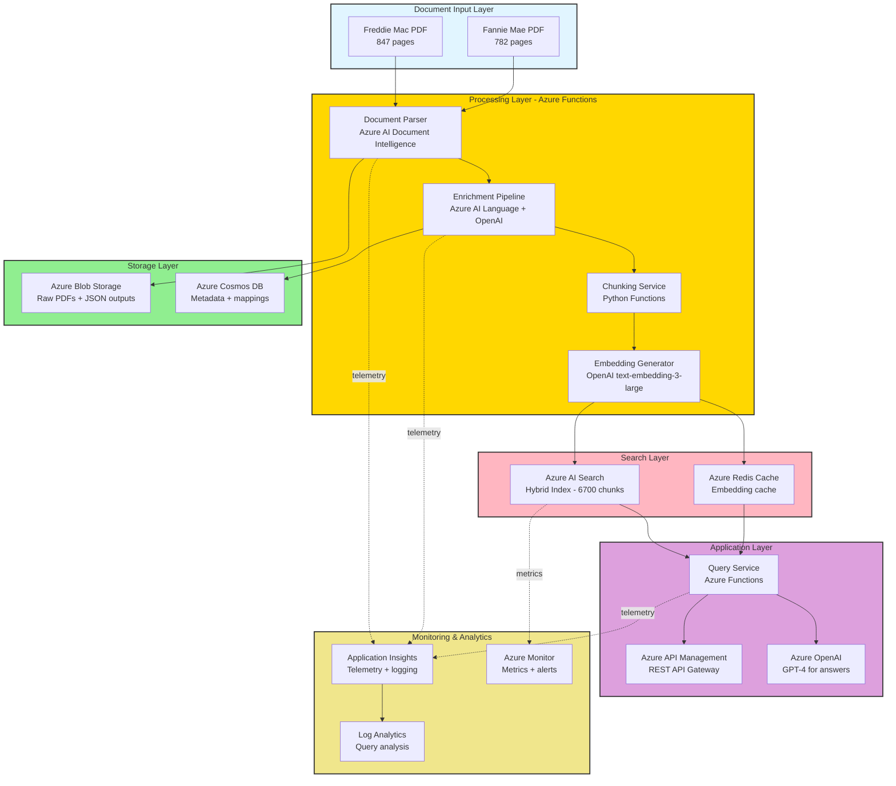
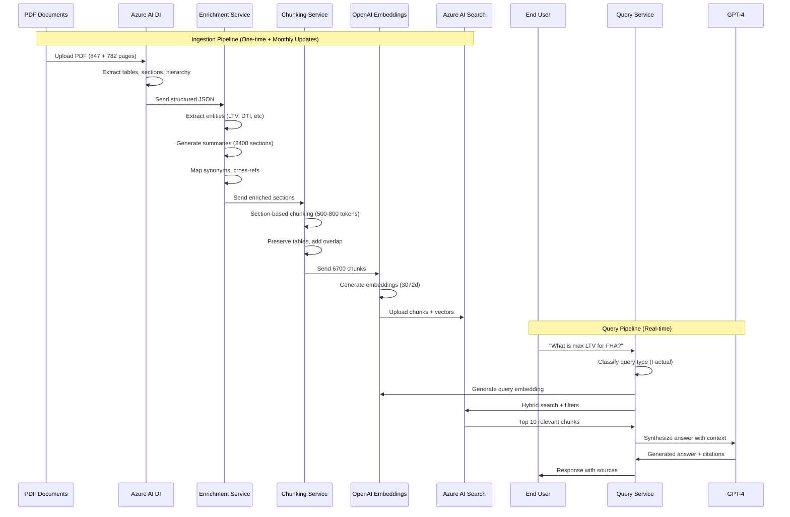

# Azure Implementation Design
## Freddie Mac & Fannie Mae Seller's Guide Indexing System

**Document Version**: 1.0  
**Created**: November 11, 2025  
**Architecture**: Unified Index Approach  
**Azure Region**: East US (primary), West US 2 (failover)

---

## Table of Contents

1. [Architecture Overview](#1-architecture-overview)
2. [Azure Resources & Configuration](#2-azure-resources--configuration)
3. [Phase 1: Document Parsing](#3-phase-1-document-parsing)
4. [Phase 2: Data Enrichment](#4-phase-2-data-enrichment)
5. [Phase 3: Chunking Strategy](#5-phase-3-chunking-strategy)
6. [Phase 4: Index Configuration](#6-phase-4-index-configuration)
7. [Phase 5: Search Implementation](#7-phase-5-search-implementation)
8. [Phase 6: Testing & Evaluation](#8-phase-6-testing--evaluation)
9. [Deployment & Operations](#9-deployment--operations)
10. [Monitoring & Observability](#10-monitoring--observability)
11. [Code Samples](#11-code-samples)

---

## 1. Architecture Overview

### 1.1 High-Level Architecture



### 1.2 Data Flow



### 1.3 Technology Stack

| Layer | Technology | Purpose | SKU/Tier |
|-------|-----------|---------|----------|
| **Document Parsing** | Azure AI Document Intelligence | PDF layout analysis, table extraction | S0 (Standard) |
| **Entity Extraction** | Azure AI Language | NER, key phrase extraction | S (Standard) |
| **Semantic Enrichment** | Azure OpenAI GPT-4 | Summaries, Q&A generation | Standard |
| **Embeddings** | Azure OpenAI text-embedding-3-large | Vector generation (3072d) | Standard |
| **Search Index** | Azure AI Search | Hybrid search (BM25 + vector) | S1 (Standard) |
| **Caching** | Azure Redis Cache | Embedding cache, query cache | C1 (Standard) |
| **Metadata Store** | Azure Cosmos DB for NoSQL | Section mappings, synonyms | Serverless |
| **Blob Storage** | Azure Blob Storage | Raw PDFs, JSON outputs | Hot tier, LRS |
| **Compute** | Azure Functions (Python 3.11) | Processing pipelines | Premium EP1 |
| **API Gateway** | Azure API Management | API façade, rate limiting | Developer tier |
| **Monitoring** | Application Insights | Telemetry, logging | Pay-as-you-go |
| **Orchestration** | Azure Logic Apps | Monthly update workflows | Consumption |

---

## 2. Azure Resources & Configuration

### 2.1 Resource Group Structure

```
rg-freddiemac-indexing-prod
├── Document Intelligence
│   └── docint-freddiemac-prod (East US)
├── AI Services
│   ├── lang-freddiemac-prod (East US)
│   └── openai-freddiemac-prod (East US)
├── Search
│   ├── srch-freddiemac-prod (East US)
│   └── redis-freddiemac-prod (East US, C1)
├── Storage
│   ├── stfreddiemac001 (East US, Hot LRS)
│   └── cosmos-freddiemac-prod (East US, Serverless)
├── Compute
│   ├── func-parser-prod (Premium EP1)
│   ├── func-enricher-prod (Premium EP1)
│   ├── func-chunker-prod (Premium EP1)
│   └── func-query-prod (Premium EP2)
├── API & Integration
│   ├── apim-freddiemac-prod (Developer)
│   └── logic-updater-prod (Consumption)
└── Monitoring
    ├── appins-freddiemac-prod
    └── log-freddiemac-prod
```

### 2.2 Azure CLI Provisioning Script

```bash
#!/bin/bash
# Azure Resource Provisioning Script
# Version: 1.0
# Date: 2025-11-11

# Variables
RESOURCE_GROUP="rg-freddiemac-indexing-prod"
LOCATION="eastus"
SUBSCRIPTION_ID="<your-subscription-id>"

# Set subscription
az account set --subscription $SUBSCRIPTION_ID

# Create Resource Group
az group create \
  --name $RESOURCE_GROUP \
  --location $LOCATION \
  --tags Environment=Production Project=FreddieMacIndexing

# --- Document Intelligence ---
az cognitiveservices account create \
  --name docint-freddiemac-prod \
  --resource-group $RESOURCE_GROUP \
  --kind FormRecognizer \
  --sku S0 \
  --location $LOCATION \
  --yes

# --- Azure AI Language ---
az cognitiveservices account create \
  --name lang-freddiemac-prod \
  --resource-group $RESOURCE_GROUP \
  --kind TextAnalytics \
  --sku S \
  --location $LOCATION \
  --yes

# --- Azure OpenAI ---
az cognitiveservices account create \
  --name openai-freddiemac-prod \
  --resource-group $RESOURCE_GROUP \
  --kind OpenAI \
  --sku S0 \
  --location $LOCATION \
  --yes

# Deploy GPT-4 model
az cognitiveservices account deployment create \
  --name openai-freddiemac-prod \
  --resource-group $RESOURCE_GROUP \
  --deployment-name gpt-4 \
  --model-name gpt-4 \
  --model-version "turbo-2024-04-09" \
  --model-format OpenAI \
  --sku-capacity 50 \
  --sku-name Standard

# Deploy text-embedding-3-large model
az cognitiveservices account deployment create \
  --name openai-freddiemac-prod \
  --resource-group $RESOURCE_GROUP \
  --deployment-name text-embedding-3-large \
  --model-name text-embedding-3-large \
  --model-version "1" \
  --model-format OpenAI \
  --sku-capacity 100 \
  --sku-name Standard

# --- Azure AI Search ---
az search service create \
  --name srch-freddiemac-prod \
  --resource-group $RESOURCE_GROUP \
  --sku Standard \
  --partition-count 1 \
  --replica-count 2 \
  --location $LOCATION

# --- Azure Redis Cache ---
az redis create \
  --name redis-freddiemac-prod \
  --resource-group $RESOURCE_GROUP \
  --location $LOCATION \
  --sku Standard \
  --vm-size C1 \
  --enable-non-ssl-port false

# --- Azure Storage Account ---
az storage account create \
  --name stfreddiemac001 \
  --resource-group $RESOURCE_GROUP \
  --location $LOCATION \
  --sku Standard_LRS \
  --kind StorageV2 \
  --access-tier Hot

# Create blob containers
STORAGE_KEY=$(az storage account keys list \
  --account-name stfreddiemac001 \
  --resource-group $RESOURCE_GROUP \
  --query "[0].value" -o tsv)

az storage container create \
  --name raw-pdfs \
  --account-name stfreddiemac001 \
  --account-key $STORAGE_KEY

az storage container create \
  --name parsed-json \
  --account-name stfreddiemac001 \
  --account-key $STORAGE_KEY

az storage container create \
  --name enriched-sections \
  --account-name stfreddiemac001 \
  --account-key $STORAGE_KEY

az storage container create \
  --name final-chunks \
  --account-name stfreddiemac001 \
  --account-key $STORAGE_KEY

# --- Azure Cosmos DB ---
az cosmosdb create \
  --name cosmos-freddiemac-prod \
  --resource-group $RESOURCE_GROUP \
  --locations regionName=$LOCATION failoverPriority=0 \
  --capabilities EnableServerless

# Create database and containers
az cosmosdb sql database create \
  --account-name cosmos-freddiemac-prod \
  --resource-group $RESOURCE_GROUP \
  --name FreddieMacDB

az cosmosdb sql container create \
  --account-name cosmos-freddiemac-prod \
  --resource-group $RESOURCE_GROUP \
  --database-name FreddieMacDB \
  --name SectionMappings \
  --partition-key-path "/documentSource"

az cosmosdb sql container create \
  --account-name cosmos-freddiemac-prod \
  --resource-group $RESOURCE_GROUP \
  --database-name FreddieMacDB \
  --name SynonymMaps \
  --partition-key-path "/category"

az cosmosdb sql container create \
  --account-name cosmos-freddiemac-prod \
  --resource-group $RESOURCE_GROUP \
  --database-name FreddieMacDB \
  --name ProcessingMetadata \
  --partition-key-path "/documentId"

# --- Application Insights ---
az monitor app-insights component create \
  --app appins-freddiemac-prod \
  --location $LOCATION \
  --resource-group $RESOURCE_GROUP \
  --application-type web

# --- Log Analytics Workspace ---
az monitor log-analytics workspace create \
  --resource-group $RESOURCE_GROUP \
  --workspace-name log-freddiemac-prod \
  --location $LOCATION

# --- Azure Functions (Premium Plan) ---
az functionapp plan create \
  --name plan-freddiemac-prod \
  --resource-group $RESOURCE_GROUP \
  --location $LOCATION \
  --sku EP1 \
  --is-linux true

# Create Function Apps
for FUNC_NAME in func-parser-prod func-enricher-prod func-chunker-prod; do
  az functionapp create \
    --name $FUNC_NAME \
    --resource-group $RESOURCE_GROUP \
    --plan plan-freddiemac-prod \
    --runtime python \
    --runtime-version 3.11 \
    --functions-version 4 \
    --storage-account stfreddiemac001 \
    --app-insights appins-freddiemac-prod
done

# Query service needs more capacity
az functionapp plan create \
  --name plan-query-prod \
  --resource-group $RESOURCE_GROUP \
  --location $LOCATION \
  --sku EP2 \
  --is-linux true

az functionapp create \
  --name func-query-prod \
  --resource-group $RESOURCE_GROUP \
  --plan plan-query-prod \
  --runtime python \
  --runtime-version 3.11 \
  --functions-version 4 \
  --storage-account stfreddiemac001 \
  --app-insights appins-freddiemac-prod

# --- Azure API Management ---
az apim create \
  --name apim-freddiemac-prod \
  --resource-group $RESOURCE_GROUP \
  --location $LOCATION \
  --publisher-email admin@company.com \
  --publisher-name "Freddie Mac Team" \
  --sku-name Developer

echo "✅ All Azure resources provisioned successfully!"
echo "📋 Next steps:"
echo "   1. Configure Function App settings (connection strings, keys)"
echo "   2. Deploy function code"
echo "   3. Create Azure AI Search index schema"
echo "   4. Set up API Management policies"
```

### 2.3 Cost Estimation (Monthly)

| Resource | SKU | Units | Monthly Cost |
|----------|-----|-------|--------------|
| Azure AI Document Intelligence | S0 | 1,629 pages/month | $489 |
| Azure AI Language | S | ~5K requests/month | $25 |
| Azure OpenAI - GPT-4 | Standard | 500K tokens/month | $150 |
| Azure OpenAI - Embeddings | Standard | 4M tokens/month | $40 |
| Azure AI Search | S1 | 1 partition, 2 replicas | $500 |
| Azure Redis Cache | C1 | Standard tier | $55 |
| Azure Cosmos DB | Serverless | ~100K RU/month | $25 |
| Azure Blob Storage | Hot LRS | 10 GB | $2 |
| Azure Functions | Premium EP1/EP2 | 3×EP1 + 1×EP2 | $440 |
| Azure API Management | Developer | 1 unit | $50 |
| Application Insights | Standard | ~10GB/month | $25 |
| **Total Estimated Monthly Cost** | | | **$1,801** |

**Note**: Costs are estimates. Actual costs depend on usage patterns. Initial implementation phase will be higher due to one-time processing (~$950 additional).

---

## 3. Phase 1: Document Parsing

### 3.1 Azure AI Document Intelligence Configuration

**API Version**: `2024-07-31-preview`  
**Model**: `prebuilt-layout`  
**Features**: Table detection, section hierarchy, paragraph roles

#### 3.1.1 Document Intelligence Schema

```json
{
  "api_version": "2024-07-31-preview",
  "model_id": "prebuilt-layout",
  "features": [
    "tables",
    "paragraphs",
    "keyValuePairs",
    "styles"
  ],
  "options": {
    "pages": "1-end",
    "locale": "en-US",
    "high_resolution": true
  }
}
```

#### 3.1.2 Parser Function (Python)

```python
# functions/parser/document_parser.py

import os
import json
import logging
from azure.ai.formrecognizer import DocumentAnalysisClient
from azure.core.credentials import AzureKeyCredential
from azure.storage.blob import BlobServiceClient
import azure.functions as func

# Configuration
DOCINT_ENDPOINT = os.environ["DOCINT_ENDPOINT"]
DOCINT_KEY = os.environ["DOCINT_KEY"]
STORAGE_CONN_STR = os.environ["STORAGE_CONNECTION_STRING"]

logger = logging.getLogger(__name__)

class DocumentParser:
    def __init__(self):
        self.client = DocumentAnalysisClient(
            endpoint=DOCINT_ENDPOINT,
            credential=AzureKeyCredential(DOCINT_KEY)
        )
        self.blob_service = BlobServiceClient.from_connection_string(
            STORAGE_CONN_STR
        )
    
    def parse_pdf(self, pdf_blob_url: str, document_id: str) -> dict:
        """
        Parse PDF using Azure AI Document Intelligence.
        
        Args:
            pdf_blob_url: URL to PDF in blob storage
            document_id: Unique document identifier
            
        Returns:
            Structured document with sections, tables, hierarchy
        """
        logger.info(f"Starting parse for document: {document_id}")
        
        # Begin analysis
        poller = self.client.begin_analyze_document_from_url(
            model_id="prebuilt-layout",
            document_url=pdf_blob_url,
            features=["tables", "paragraphs", "keyValuePairs", "styles"]
        )
        
        result = poller.result()
        
        # Extract structured content
        document_structure = {
            "document_id": document_id,
            "pages": len(result.pages),
            "sections": [],
            "tables": [],
            "metadata": {
                "model_version": result.model_id,
                "api_version": result.api_version
            }
        }
        
        # Process tables
        for table_idx, table in enumerate(result.tables):
            table_data = self._extract_table(table, table_idx)
            document_structure["tables"].append(table_data)
        
        # Process sections and paragraphs
        sections = self._extract_sections(result.paragraphs, result.pages)
        document_structure["sections"] = sections
        
        # Save to blob storage
        self._save_parsed_document(document_structure, document_id)
        
        logger.info(f"Parse complete: {len(sections)} sections, {len(result.tables)} tables")
        return document_structure
    
    def _extract_table(self, table, table_idx: int) -> dict:
        """Extract table data with structure preservation."""
        table_data = {
            "table_id": f"table_{table_idx}",
            "row_count": table.row_count,
            "column_count": table.column_count,
            "page_number": table.bounding_regions[0].page_number,
            "cells": [],
            "markdown": self._table_to_markdown(table)
        }
        
        for cell in table.cells:
            table_data["cells"].append({
                "row_index": cell.row_index,
                "column_index": cell.column_index,
                "content": cell.content,
                "kind": cell.kind if hasattr(cell, 'kind') else "content"
            })
        
        return table_data
    
    def _table_to_markdown(self, table) -> str:
        """Convert table to markdown format."""
        rows = [['' for _ in range(table.column_count)] 
                for _ in range(table.row_count)]
        
        for cell in table.cells:
            rows[cell.row_index][cell.column_index] = cell.content
        
        # Create markdown
        markdown = "| " + " | ".join(rows[0]) + " |\n"
        markdown += "| " + " | ".join(["---"] * table.column_count) + " |\n"
        
        for row in rows[1:]:
            markdown += "| " + " | ".join(row) + " |\n"
        
        return markdown
    
    def _extract_sections(self, paragraphs, pages) -> list:
        """
        Extract hierarchical sections from paragraphs.
        Identifies section headers and builds hierarchy.
        """
        sections = []
        current_section = None
        section_pattern = r'^\d+(\.\d+)*\s+'  # Matches: 5467.2, B3-1.2-04
        
        for para in paragraphs:
            content = para.content.strip()
            page_num = para.bounding_regions[0].page_number if para.bounding_regions else 0
            
            # Check if paragraph is a section header
            if self._is_section_header(para):
                # Save previous section
                if current_section:
                    sections.append(current_section)
                
                # Start new section
                section_number = self._extract_section_number(content)
                current_section = {
                    "section_number": section_number,
                    "section_title": content,
                    "page_start": page_num,
                    "page_end": page_num,
                    "content": [],
                    "role": para.role if hasattr(para, 'role') else "section"
                }
            elif current_section:
                # Add content to current section
                current_section["content"].append({
                    "text": content,
                    "page": page_num,
                    "role": para.role if hasattr(para, 'role') else "paragraph"
                })
                current_section["page_end"] = page_num
        
        # Add last section
        if current_section:
            sections.append(current_section)
        
        return sections
    
    def _is_section_header(self, paragraph) -> bool:
        """Determine if paragraph is a section header based on style."""
        if hasattr(paragraph, 'role') and paragraph.role in ['title', 'sectionHeading']:
            return True
        
        # Additional heuristics
        content = paragraph.content.strip()
        if len(content) < 200 and any(char.isdigit() for char in content[:20]):
            return True
        
        return False
    
    def _extract_section_number(self, text: str) -> str:
        """Extract section number from header text."""
        import re
        
        # Try patterns: 5467.2 or B3-1.2-04
        patterns = [
            r'(\d+(?:\.\d+)+)',  # 5467.2
            r'([A-Z]\d+-\d+(?:\.\d+)*(?:-\d+)?)'  # B3-1.2-04
        ]
        
        for pattern in patterns:
            match = re.search(pattern, text)
            if match:
                return match.group(1)
        
        return "UNKNOWN"
    
    def _save_parsed_document(self, document: dict, document_id: str):
        """Save parsed document to blob storage."""
        container_client = self.blob_service.get_container_client("parsed-json")
        blob_client = container_client.get_blob_client(f"{document_id}_parsed.json")
        
        json_data = json.dumps(document, indent=2)
        blob_client.upload_blob(json_data, overwrite=True)
        
        logger.info(f"Saved parsed document to blob: {document_id}_parsed.json")


# Azure Function entry point
def main(blobtrigger: func.InputStream, context: func.Context):
    """
    Triggered when PDF uploaded to 'raw-pdfs' container.
    """
    logger.info(f"Processing blob: {blobtrigger.name}")
    
    # Extract document info from blob name
    document_id = blobtrigger.name.replace('.pdf', '').split('/')[-1]
    blob_url = f"https://stfreddiemac001.blob.core.windows.net/{blobtrigger.name}"
    
    # Parse document
    parser = DocumentParser()
    result = parser.parse_pdf(blob_url, document_id)
    
    logger.info(f"✅ Parsing complete for {document_id}")
    
    return {
        "document_id": document_id,
        "sections_count": len(result["sections"]),
        "tables_count": len(result["tables"]),
        "pages": result["pages"]
    }
```

#### 3.1.3 Expected Output Structure

```json
{
  "document_id": "freddiemac_sellers_guide_10_08_25",
  "pages": 847,
  "sections": [
    {
      "section_number": "5467.2",
      "section_title": "5467.2 Maximum LTV/CLTV/HCLTV Ratios",
      "page_start": 234,
      "page_end": 237,
      "content": [
        {
          "text": "The maximum LTV, CLTV, and HCLTV ratios for Mortgages...",
          "page": 234,
          "role": "paragraph"
        }
      ],
      "role": "section"
    }
  ],
  "tables": [
    {
      "table_id": "table_0",
      "row_count": 5,
      "column_count": 4,
      "page_number": 234,
      "cells": [...],
      "markdown": "| Loan Type | Max LTV | Max CLTV | Max HCLTV |\n..."
    }
  ],
  "metadata": {
    "model_version": "prebuilt-layout",
    "api_version": "2024-07-31-preview"
  }
}
```

---

## 4. Phase 2: Data Enrichment

### 4.1 Entity Extraction (Azure AI Language)

#### 4.1.1 Custom Entity Configuration

```python
# functions/enricher/entity_extractor.py

import os
import logging
from azure.ai.textanalytics import TextAnalyticsClient
from azure.core.credentials import AzureKeyCredential
from typing import List, Dict

logger = logging.getLogger(__name__)

LANGUAGE_ENDPOINT = os.environ["LANGUAGE_ENDPOINT"]
LANGUAGE_KEY = os.environ["LANGUAGE_KEY"]

class EntityExtractor:
    def __init__(self):
        self.client = TextAnalyticsClient(
            endpoint=LANGUAGE_ENDPOINT,
            credential=AzureKeyCredential(LANGUAGE_KEY)
        )
        
        # Custom entity categories for financial documents
        self.entity_categories = [
            "LoanType",       # Conventional, FHA, VA, Jumbo
            "FinancialTerm",  # LTV, DTI, FICO, CLTV, HCLTV
            "SectionReference",  # 5467.2, B3-1.2-04
            "NumericalCriteria",  # 97%, 620, $510,400
            "Program",        # HomeReady, Home Possible
            "Document"        # Guide, Manual, Bulletin
        ]
    
    def extract_entities(self, text: str, section_id: str) -> Dict:
        """
        Extract entities from text using Azure AI Language.
        
        Args:
            text: Section text content
            section_id: Section identifier for tracking
            
        Returns:
            Dictionary of extracted entities by category
        """
        logger.info(f"Extracting entities for section: {section_id}")
        
        # Standard NER
        response = self.client.recognize_entities(
            documents=[text],
            language="en"
        )
        
        entities_by_category = {cat: [] for cat in self.entity_categories}
        
        for doc in response:
            if not doc.is_error:
                for entity in doc.entities:
                    # Map standard entities to custom categories
                    category = self._map_entity_category(entity)
                    if category:
                        entities_by_category[category].append({
                            "text": entity.text,
                            "confidence": entity.confidence_score,
                            "offset": entity.offset,
                            "length": entity.length
                        })
        
        # Custom pattern matching for domain-specific entities
        custom_entities = self._extract_custom_patterns(text)
        for category, items in custom_entities.items():
            entities_by_category[category].extend(items)
        
        # Extract key phrases
        key_phrases = self._extract_key_phrases(text)
        entities_by_category["key_phrases"] = key_phrases
        
        logger.info(f"Extracted {sum(len(v) for v in entities_by_category.values())} entities")
        return entities_by_category
    
    def _map_entity_category(self, entity) -> str:
        """Map standard entity categories to custom financial categories."""
        category_mapping = {
            "Quantity": "NumericalCriteria",
            "DateTime": "NumericalCriteria",
            "Product": "LoanType",
            "Organization": "Program"
        }
        return category_mapping.get(entity.category, None)
    
    def _extract_custom_patterns(self, text: str) -> Dict[str, List]:
        """Extract domain-specific patterns using regex."""
        import re
        
        patterns = {
            "FinancialTerm": [
                r'\bLTV\b', r'\bCLTV\b', r'\bHCLTV\b', r'\bDTI\b', 
                r'\bFICO\b', r'\bloan-to-value\b', r'\bdebt-to-income\b'
            ],
            "SectionReference": [
                r'\b\d+(?:\.\d+)+\b',  # 5467.2
                r'\b[A-Z]\d+-\d+(?:\.\d+)*(?:-\d+)?\b'  # B3-1.2-04
            ],
            "LoanType": [
                r'\bConventional\b', r'\bFHA\b', r'\bVA\b', r'\bJumbo\b',
                r'\bUSDA\b', r'\bQM\b', r'\bNon-QM\b'
            ],
            "NumericalCriteria": [
                r'\b\d+(?:\.\d+)?%\b',  # 97%, 3.5%
                r'\$[\d,]+\b',  # $510,400
                r'\b\d{3}\b(?=\s*credit\s*score|\s*FICO)'  # 620 credit score
            ]
        }
        
        extracted = {cat: [] for cat in patterns.keys()}
        
        for category, pattern_list in patterns.items():
            for pattern in pattern_list:
                matches = re.finditer(pattern, text, re.IGNORECASE)
                for match in matches:
                    extracted[category].append({
                        "text": match.group(),
                        "confidence": 1.0,
                        "offset": match.start(),
                        "length": match.end() - match.start()
                    })
        
        # Deduplicate
        for category in extracted:
            seen = set()
            unique = []
            for item in extracted[category]:
                if item["text"].lower() not in seen:
                    seen.add(item["text"].lower())
                    unique.append(item)
            extracted[category] = unique
        
        return extracted
    
    def _extract_key_phrases(self, text: str) -> List[str]:
        """Extract key phrases using Azure AI Language."""
        response = self.client.extract_key_phrases(
            documents=[text],
            language="en"
        )
        
        phrases = []
        for doc in response:
            if not doc.is_error:
                phrases.extend(doc.key_phrases)
        
        return phrases[:20]  # Top 20 key phrases
```

### 4.2 Semantic Enrichment (Azure OpenAI GPT-4)

#### 4.2.1 Summary Generation

```python
# functions/enricher/semantic_enricher.py

import os
import logging
from openai import AzureOpenAI
from typing import List, Dict
import json

logger = logging.getLogger(__name__)

OPENAI_ENDPOINT = os.environ["OPENAI_ENDPOINT"]
OPENAI_KEY = os.environ["OPENAI_KEY"]
OPENAI_API_VERSION = "2024-08-01-preview"

class SemanticEnricher:
    def __init__(self):
        self.client = AzureOpenAI(
            azure_endpoint=OPENAI_ENDPOINT,
            api_key=OPENAI_KEY,
            api_version=OPENAI_API_VERSION
        )
        self.gpt4_deployment = "gpt-4"
    
    def generate_summary(self, section_text: str, section_number: str) -> str:
        """
        Generate concise summary of section content.
        
        Args:
            section_text: Full section text
            section_number: Section identifier (5467.2)
            
        Returns:
            2-3 sentence summary
        """
        prompt = f"""You are analyzing financial regulatory documentation. 
Summarize the following section in 2-3 clear, concise sentences.
Focus on key requirements, limits, and procedures.

Section: {section_number}

Content:
{section_text[:3000]}  # Limit to avoid token overflow

Summary:"""
        
        response = self.client.chat.completions.create(
            model=self.gpt4_deployment,
            messages=[
                {"role": "system", "content": "You are a financial document analyst specializing in mortgage guidelines."},
                {"role": "user", "content": prompt}
            ],
            temperature=0.3,
            max_tokens=200
        )
        
        summary = response.choices[0].message.content.strip()
        logger.info(f"Generated summary for {section_number}: {len(summary)} chars")
        return summary
    
    def generate_questions(self, section_text: str, section_number: str) -> List[str]:
        """
        Generate likely user questions for this section.
        
        Args:
            section_text: Full section text
            section_number: Section identifier
            
        Returns:
            List of 3-5 questions users might ask
        """
        prompt = f"""Based on the following regulatory section, generate 3-5 questions that customer service representatives or loan officers might ask.

Focus on:
- Specific requirements or limits
- Eligibility criteria
- Procedural questions
- Comparison questions

Section: {section_number}

Content:
{section_text[:3000]}

Generate questions in JSON format:
{{
  "questions": [
    "What is the maximum LTV for...",
    "Can a borrower with..."
  ]
}}
"""
        
        response = self.client.chat.completions.create(
            model=self.gpt4_deployment,
            messages=[
                {"role": "system", "content": "You are generating training questions for a customer service AI system."},
                {"role": "user", "content": prompt}
            ],
            temperature=0.5,
            max_tokens=300,
            response_format={"type": "json_object"}
        )
        
        questions_json = json.loads(response.choices[0].message.content)
        questions = questions_json.get("questions", [])
        
        logger.info(f"Generated {len(questions)} questions for {section_number}")
        return questions
    
    def map_synonyms(self, term: str, context: str = "") -> List[str]:
        """
        Generate synonyms and related terms for financial terminology.
        
        Args:
            term: Financial term (e.g., "LTV")
            context: Optional context
            
        Returns:
            List of synonyms and related phrases
        """
        prompt = f"""For the financial term "{term}", provide a list of synonyms, acronyms, and related phrases that users might use when asking questions.

Context: {context if context else "Mortgage lending and loan guidelines"}

Return JSON format:
{{
  "term": "{term}",
  "synonyms": ["synonym1", "synonym2", ...],
  "related_terms": ["related1", "related2", ...]
}}
"""
        
        response = self.client.chat.completions.create(
            model=self.gpt4_deployment,
            messages=[
                {"role": "system", "content": "You are a financial terminology expert."},
                {"role": "user", "content": prompt}
            ],
            temperature=0.3,
            max_tokens=200,
            response_format={"type": "json_object"}
        )
        
        result = json.loads(response.choices[0].message.content)
        synonyms = result.get("synonyms", []) + result.get("related_terms", [])
        
        return list(set(synonyms))  # Deduplicate
    
    def extract_cross_references(self, section_text: str) -> List[Dict]:
        """
        Extract cross-references to other sections.
        
        Args:
            section_text: Full section text
            
        Returns:
            List of cross-reference dictionaries
        """
        import re
        
        # Pattern: "See Section 5467.8" or "refer to B3-1.2-04"
        patterns = [
            r'[Ss]ee\s+[Ss]ection\s+([\d\.]+)',
            r'[Rr]efer\s+to\s+[Ss]ection\s+([\d\.]+)',
            r'[Ss]ee\s+([A-Z]\d+-[\d\.-]+)',
            r'[Rr]efer\s+to\s+([A-Z]\d+-[\d\.-]+)'
        ]
        
        cross_refs = []
        for pattern in patterns:
            matches = re.finditer(pattern, section_text)
            for match in matches:
                cross_refs.append({
                    "referenced_section": match.group(1),
                    "context": section_text[max(0, match.start()-50):match.end()+50]
                })
        
        return cross_refs
```

### 4.3 Section Mapping (Fannie Mae ↔ Freddie Mac)

```python
# functions/enricher/section_mapper.py

import os
import logging
from openai import AzureOpenAI
from azure.cosmos import CosmosClient
import json

logger = logging.getLogger(__name__)

COSMOS_ENDPOINT = os.environ["COSMOS_ENDPOINT"]
COSMOS_KEY = os.environ["COSMOS_KEY"]
OPENAI_ENDPOINT = os.environ["OPENAI_ENDPOINT"]
OPENAI_KEY = os.environ["OPENAI_KEY"]

class SectionMapper:
    def __init__(self):
        self.cosmos_client = CosmosClient(COSMOS_ENDPOINT, COSMOS_KEY)
        self.database = self.cosmos_client.get_database_client("FreddieMacDB")
        self.container = self.database.get_container_client("SectionMappings")
        
        self.openai_client = AzureOpenAI(
            azure_endpoint=OPENAI_ENDPOINT,
            api_key=OPENAI_KEY,
            api_version="2024-08-01-preview"
        )
    
    def create_section_mapping(
        self, 
        fannie_section: Dict, 
        freddie_section: Dict
    ) -> Dict:
        """
        Create mapping between equivalent Fannie Mae and Freddie Mac sections.
        Uses GPT-4 to verify semantic equivalence.
        
        Args:
            fannie_section: Fannie Mae section data
            freddie_section: Freddie Mac section data
            
        Returns:
            Mapping record with confidence score
        """
        # Use GPT-4 to assess equivalence
        prompt = f"""Compare these two regulatory sections and determine if they cover the same topic/requirement.

Fannie Mae Section {fannie_section['section_number']}:
{fannie_section['section_title']}
{fannie_section.get('summary', '')}

Freddie Mac Section {freddie_section['section_number']}:
{freddie_section['section_title']}
{freddie_section.get('summary', '')}

Return JSON:
{{
  "equivalent": true/false,
  "confidence": 0.0-1.0,
  "differences": ["list of key differences if any"],
  "explanation": "brief explanation"
}}
"""
        
        response = self.openai_client.chat.completions.create(
            model="gpt-4",
            messages=[
                {"role": "system", "content": "You are comparing mortgage guideline sections for equivalence."},
                {"role": "user", "content": prompt}
            ],
            temperature=0.2,
            response_format={"type": "json_object"}
        )
        
        result = json.loads(response.choices[0].message.content)
        
        if result["equivalent"] and result["confidence"] >= 0.7:
            # Store mapping
            mapping = {
                "id": f"{fannie_section['section_number']}_{freddie_section['section_number']}",
                "fannie_section": fannie_section['section_number'],
                "freddie_section": freddie_section['section_number'],
                "confidence": result["confidence"],
                "differences": result.get("differences", []),
                "explanation": result["explanation"],
                "documentSource": "mapping"
            }
            
            self.container.upsert_item(mapping)
            logger.info(f"Created mapping: {mapping['id']}")
            return mapping
        
        return None
    
    def get_equivalent_section(self, section_number: str, source: str) -> Dict:
        """
        Get equivalent section from opposite document source.
        
        Args:
            section_number: Section to find equivalent for
            source: 'fannie_mae' or 'freddie_mac'
            
        Returns:
            Equivalent section mapping or None
        """
        query = f"SELECT * FROM c WHERE c.{source}_section = @section"
        items = list(self.container.query_items(
            query=query,
            parameters=[{"name": "@section", "value": section_number}],
            enable_cross_partition_query=True
        ))
        
        return items[0] if items else None
```

---

## 5. Phase 3: Chunking Strategy

### 5.1 Section-Based Chunker

```python
# functions/chunker/section_chunker.py

import os
import logging
import tiktoken
from typing import List, Dict
from dataclasses import dataclass

logger = logging.getLogger(__name__)

@dataclass
class Chunk:
    chunk_id: str
    document_id: str
    document_source: str  # 'fannie_mae' or 'freddie_mac'
    section_number: str
    section_title: str
    content: str
    token_count: int
    page_start: int
    page_end: int
    chunk_index: int  # For multi-chunk sections
    has_table: bool
    entities: Dict
    summary: str
    questions: List[str]
    
class SectionChunker:
    def __init__(self):
        self.encoding = tiktoken.get_encoding("cl100k_base")  # GPT-4 encoding
        self.target_tokens = 600  # Target: 500-800 tokens
        self.min_tokens = 100
        self.max_tokens = 1000
        self.overlap_tokens = 75  # ~10-15% overlap
    
    def chunk_document(self, parsed_doc: Dict, enriched_doc: Dict) -> List[Chunk]:
        """
        Create chunks from parsed and enriched document.
        
        Strategy:
        1. Preserve section boundaries
        2. Keep tables intact (never split)
        3. Target 500-800 tokens per chunk
        4. Add 10-15% overlap for context
        
        Args:
            parsed_doc: Output from document parser
            enriched_doc: Output from enrichment pipeline
            
        Returns:
            List of Chunk objects ready for indexing
        """
        logger.info(f"Chunking document: {parsed_doc['document_id']}")
        
        chunks = []
        chunk_counter = 0
        
        for section in parsed_doc["sections"]:
            section_number = section["section_number"]
            
            # Get enrichment data for this section
            section_enrichment = enriched_doc["sections"].get(section_number, {})
            
            # Build section content
            section_text = self._build_section_text(section, parsed_doc["tables"])
            section_tokens = self._count_tokens(section_text)
            
            # Check if section has tables
            has_table = any(
                section["page_start"] <= table["page_number"] <= section["page_end"]
                for table in parsed_doc["tables"]
            )
            
            # Decide chunking strategy
            if section_tokens <= self.max_tokens:
                # Section fits in one chunk
                chunk = Chunk(
                    chunk_id=f"{parsed_doc['document_id']}_chunk_{chunk_counter:04d}",
                    document_id=parsed_doc['document_id'],
                    document_source=self._get_document_source(parsed_doc['document_id']),
                    section_number=section_number,
                    section_title=section.get("section_title", ""),
                    content=section_text,
                    token_count=section_tokens,
                    page_start=section["page_start"],
                    page_end=section["page_end"],
                    chunk_index=0,
                    has_table=has_table,
                    entities=section_enrichment.get("entities", {}),
                    summary=section_enrichment.get("summary", ""),
                    questions=section_enrichment.get("questions", [])
                )
                chunks.append(chunk)
                chunk_counter += 1
            else:
                # Section too large - split while preserving tables
                section_chunks = self._split_large_section(
                    section, 
                    parsed_doc, 
                    section_enrichment,
                    chunk_counter
                )
                chunks.extend(section_chunks)
                chunk_counter += len(section_chunks)
        
        logger.info(f"Created {len(chunks)} chunks from {len(parsed_doc['sections'])} sections")
        return chunks
    
    def _build_section_text(self, section: Dict, tables: List[Dict]) -> str:
        """
        Build complete section text including tables in correct positions.
        """
        text_parts = []
        
        # Add section title
        text_parts.append(f"# {section['section_title']}\n\n")
        
        # Add content paragraphs, inserting tables at correct positions
        for content_item in section["content"]:
            page = content_item["page"]
            
            # Insert any tables that belong on this page (before paragraph)
            for table in tables:
                if table["page_number"] == page:
                    text_parts.append(f"\n{table['markdown']}\n\n")
            
            text_parts.append(content_item["text"] + "\n\n")
        
        return "".join(text_parts)
    
    def _split_large_section(
        self, 
        section: Dict, 
        parsed_doc: Dict,
        enrichment: Dict,
        start_counter: int
    ) -> List[Chunk]:
        """
        Split large section into multiple chunks while preserving tables.
        """
        chunks = []
        current_chunk_text = []
        current_tokens = 0
        chunk_index = 0
        
        # Start with section header
        header = f"# {section['section_title']}\n\n"
        current_chunk_text.append(header)
        current_tokens = self._count_tokens(header)
        
        for content_item in section["content"]:
            item_text = content_item["text"]
            item_tokens = self._count_tokens(item_text)
            
            # Check if adding this item exceeds max tokens
            if current_tokens + item_tokens > self.max_tokens:
                # Save current chunk
                chunk = self._create_chunk_from_parts(
                    current_chunk_text,
                    section,
                    enrichment,
                    parsed_doc["document_id"],
                    start_counter + chunk_index,
                    chunk_index
                )
                chunks.append(chunk)
                
                # Start new chunk with overlap (section header)
                current_chunk_text = [header]
                current_tokens = self._count_tokens(header)
                chunk_index += 1
            
            current_chunk_text.append(item_text + "\n\n")
            current_tokens += item_tokens
        
        # Add final chunk
        if current_chunk_text:
            chunk = self._create_chunk_from_parts(
                current_chunk_text,
                section,
                enrichment,
                parsed_doc["document_id"],
                start_counter + chunk_index,
                chunk_index
            )
            chunks.append(chunk)
        
        return chunks
    
    def _create_chunk_from_parts(
        self,
        text_parts: List[str],
        section: Dict,
        enrichment: Dict,
        document_id: str,
        chunk_counter: int,
        chunk_index: int
    ) -> Chunk:
        """Helper to create Chunk object from text parts."""
        content = "".join(text_parts)
        
        return Chunk(
            chunk_id=f"{document_id}_chunk_{chunk_counter:04d}",
            document_id=document_id,
            document_source=self._get_document_source(document_id),
            section_number=section["section_number"],
            section_title=section.get("section_title", ""),
            content=content,
            token_count=self._count_tokens(content),
            page_start=section["page_start"],
            page_end=section["page_end"],
            chunk_index=chunk_index,
            has_table="table" in content.lower() or "|" in content,
            entities=enrichment.get("entities", {}),
            summary=enrichment.get("summary", ""),
            questions=enrichment.get("questions", [])
        )
    
    def _count_tokens(self, text: str) -> int:
        """Count tokens using tiktoken."""
        return len(self.encoding.encode(text))
    
    def _get_document_source(self, document_id: str) -> str:
        """Determine document source from ID."""
        if "fannie" in document_id.lower() or "fanny" in document_id.lower():
            return "fannie_mae"
        elif "freddie" in document_id.lower():
            return "freddie_mac"
        return "unknown"
```

---

## 6. Phase 4: Index Configuration

### 6.1 Azure AI Search Index Schema

```json
{
  "name": "freddiemac-unified-index",
  "fields": [
    {
      "name": "chunk_id",
      "type": "Edm.String",
      "key": true,
      "searchable": false,
      "filterable": false,
      "sortable": false,
      "facetable": false
    },
    {
      "name": "document_id",
      "type": "Edm.String",
      "searchable": false,
      "filterable": true,
      "sortable": false,
      "facetable": true
    },
    {
      "name": "document_source",
      "type": "Edm.String",
      "searchable": false,
      "filterable": true,
      "sortable": false,
      "facetable": true
    },
    {
      "name": "section_number",
      "type": "Edm.String",
      "searchable": true,
      "filterable": true,
      "sortable": false,
      "facetable": false
    },
    {
      "name": "section_title",
      "type": "Edm.String",
      "searchable": true,
      "filterable": false,
      "sortable": false,
      "facetable": false
    },
    {
      "name": "content",
      "type": "Edm.String",
      "searchable": true,
      "filterable": false,
      "sortable": false,
      "facetable": false,
      "analyzer": "en.microsoft"
    },
    {
      "name": "summary",
      "type": "Edm.String",
      "searchable": true,
      "filterable": false,
      "sortable": false,
      "facetable": false
    },
    {
      "name": "contentVector",
      "type": "Collection(Edm.Single)",
      "searchable": true,
      "filterable": false,
      "sortable": false,
      "facetable": false,
      "dimensions": 3072,
      "vectorSearchProfile": "vector-profile-1"
    },
    {
      "name": "page_start",
      "type": "Edm.Int32",
      "searchable": false,
      "filterable": true,
      "sortable": true,
      "facetable": false
    },
    {
      "name": "page_end",
      "type": "Edm.Int32",
      "searchable": false,
      "filterable": true,
      "sortable": true,
      "facetable": false
    },
    {
      "name": "has_table",
      "type": "Edm.Boolean",
      "searchable": false,
      "filterable": true,
      "sortable": false,
      "facetable": true
    },
    {
      "name": "loan_types",
      "type": "Collection(Edm.String)",
      "searchable": true,
      "filterable": true,
      "sortable": false,
      "facetable": true
    },
    {
      "name": "financial_terms",
      "type": "Collection(Edm.String)",
      "searchable": true,
      "filterable": true,
      "sortable": false,
      "facetable": true
    },
    {
      "name": "document_version",
      "type": "Edm.String",
      "searchable": false,
      "filterable": true,
      "sortable": true,
      "facetable": true
    },
    {
      "name": "ingestion_date",
      "type": "Edm.DateTimeOffset",
      "searchable": false,
      "filterable": true,
      "sortable": true,
      "facetable": false
    },
    {
      "name": "questions",
      "type": "Collection(Edm.String)",
      "searchable": true,
      "filterable": false,
      "sortable": false,
      "facetable": false
    }
  ],
  "scoringProfiles": [
    {
      "name": "boost-recent-tables",
      "text": {
        "weights": {
          "section_title": 3.0,
          "content": 1.0,
          "summary": 2.0,
          "questions": 1.5
        }
      },
      "functions": [
        {
          "type": "freshness",
          "fieldName": "ingestion_date",
          "boost": 2.0,
          "interpolation": "linear",
          "freshness": {
            "boostingDuration": "P90D"
          }
        },
        {
          "type": "tag",
          "fieldName": "has_table",
          "boost": 1.5,
          "tag": {
            "tagsParameter": "table"
          }
        }
      ]
    }
  ],
  "semanticSearch": {
    "defaultConfiguration": "semantic-config-1",
    "configurations": [
      {
        "name": "semantic-config-1",
        "prioritizedFields": {
          "titleField": {
            "fieldName": "section_title"
          },
          "contentFields": [
            {"fieldName": "content"},
            {"fieldName": "summary"}
          ],
          "keywordsFields": [
            {"fieldName": "loan_types"},
            {"fieldName": "financial_terms"}
          ]
        }
      }
    ]
  },
  "vectorSearch": {
    "algorithms": [
      {
        "name": "hnsw-1",
        "kind": "hnsw",
        "hnswParameters": {
          "metric": "cosine",
          "m": 4,
          "efConstruction": 400,
          "efSearch": 500
        }
      }
    ],
    "profiles": [
      {
        "name": "vector-profile-1",
        "algorithm": "hnsw-1",
        "vectorizer": "openai-vectorizer-1"
      }
    ],
    "vectorizers": [
      {
        "name": "openai-vectorizer-1",
        "kind": "azureOpenAI",
        "azureOpenAIParameters": {
          "resourceUri": "${OPENAI_ENDPOINT}",
          "deploymentId": "text-embedding-3-large",
          "apiKey": "${OPENAI_KEY}",
          "modelName": "text-embedding-3-large"
        }
      }
    ]
  }
}
```

### 6.2 Index Creation Script

```python
# scripts/create_index.py

import os
from azure.search.documents.indexes import SearchIndexClient
from azure.search.documents.indexes.models import *
from azure.core.credentials import AzureKeyCredential
import json

SEARCH_ENDPOINT = os.environ["SEARCH_ENDPOINT"]
SEARCH_KEY = os.environ["SEARCH_ADMIN_KEY"]
OPENAI_ENDPOINT = os.environ["OPENAI_ENDPOINT"]
OPENAI_KEY = os.environ["OPENAI_KEY"]

def create_index():
    """Create Azure AI Search index with hybrid + semantic configuration."""
    
    client = SearchIndexClient(
        endpoint=SEARCH_ENDPOINT,
        credential=AzureKeyCredential(SEARCH_KEY)
    )
    
    # Load index schema from JSON
    with open("index-schema.json", "r") as f:
        schema = json.load(f)
    
    # Replace placeholders
    schema_str = json.dumps(schema)
    schema_str = schema_str.replace("${OPENAI_ENDPOINT}", OPENAI_ENDPOINT)
    schema_str = schema_str.replace("${OPENAI_KEY}", OPENAI_KEY)
    schema = json.loads(schema_str)
    
    # Create index
    index = SearchIndex.from_dict(schema)
    
    result = client.create_or_update_index(index)
    print(f"✅ Index created: {result.name}")
    print(f"   - Fields: {len(result.fields)}")
    print(f"   - Vector dimensions: 3072")
    print(f"   - Semantic search: enabled")

if __name__ == "__main__":
    create_index()
```

---

*[Continued in next message due to length...]*

**Would you like me to continue with the remaining sections (7-11)?** These will cover:
- Phase 5: Search Implementation (query patterns, hybrid search logic)
- Phase 6: Testing & Evaluation (golden dataset, metrics)
- Deployment & Operations (CI/CD, Azure DevOps)
- Monitoring & Observability (Application Insights, dashboards)
- Complete Code Samples (end-to-end examples)